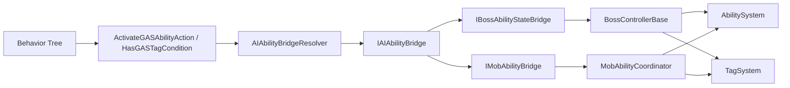
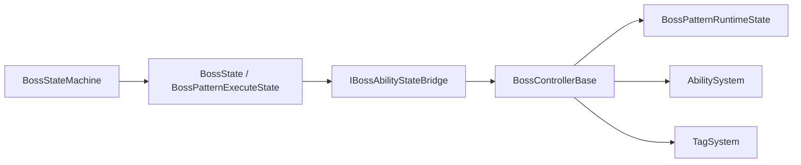
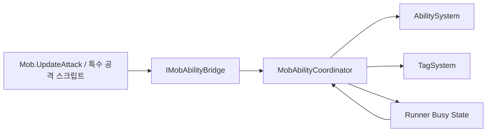
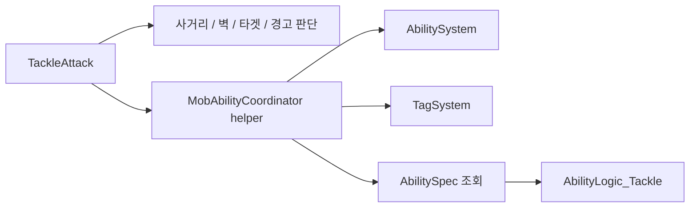
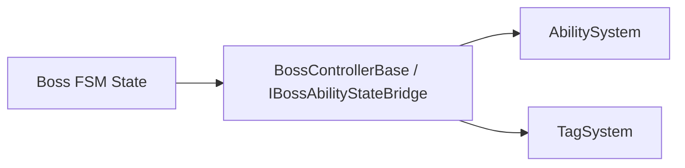
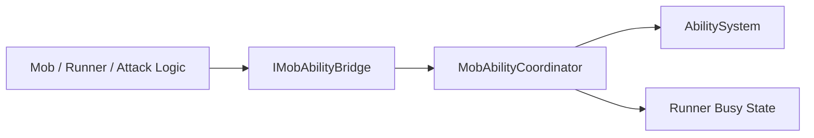
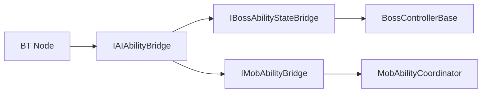

# AI / FSM Ability Integration Review

> Legacy / Review  
> 이 문서는 구조 검토와 연결 상태 조사를 위해 작성된 리뷰 문서입니다.  
> 현재 표준은 관련 아키텍처 문서를 우선하고, 이 문서는 판단 근거와 이력 확인 용도로 봅니다.

이 문서는 현재 프로젝트에서 AI/FSM가 `AbilitySystem`, `TagSystem`, 버프/디버프 구조와 어떻게 연결되어 있는지 조사한 결과를 정리합니다.

목표는 두 가지입니다.

- 이미 사실상 표준처럼 쓰이고 있는 **공식 연결 경로**를 식별한다.
- 아직 개별 스크립트가 직접 `AbilitySystem` / `TagSystem`을 호출하는 **비공식 연결 경로**를 식별한다.

---

## 결론 요약

- **보스 FSM 쪽은 이미 bridge 기반 공식 경로가 꽤 잘 잡혀 있습니다.**
  - `BossControllerBase`
  - `IBossAbilityStateBridge`
  - `BossPatternRuntimeState`
- **일반 몬스터 쪽도 coordinator 기반 공식 경로가 코어 계약으로 올라오기 시작했습니다.**
  - `MobAbilityCoordinator`
  - `IMobAbilityBridge`
- **공통 AI-ASC 최소 계약이 추가됐습니다.**
  - `IAIAbilityBridge`
- 따라서 다음 단계는
  - 이 공통 계약을 더 풍부하게 만들지
  - BT/FSM가 결과를 어떻게 해석할지 확장하는 것입니다.

---

## 조사 범위

이번 조사에서는 아래 계층을 기준으로 연결 상태를 확인했습니다.

- 보스 FSM
- 일반 몬스터 공격 루프
- Behavior Tree GAS 액션
- 직접 `AbilitySystem` / `TagSystem`을 만지는 특수 공격 스크립트

대표적으로 확인한 파일은 다음과 같습니다.

- [BossControllerBase.cs](C:/HMS/AboutCapstoneProject/CapstoneProject/CapstoneProject/Assets/Script/Enemy/Boss/FSM/Core/BossControllerBase.cs)
- [IBossAbilityStateBridge.cs](C:/HMS/AboutCapstoneProject/CapstoneProject/CapstoneProject/Assets/Script/Enemy/Boss/FSM/Core/IBossAbilityStateBridge.cs)
- [BossPatternExecuteState.cs](C:/HMS/AboutCapstoneProject/CapstoneProject/CapstoneProject/Assets/Script/Enemy/Boss/FSM/States/BossPatternExecuteState.cs)
- [MobAbilityCoordinator.cs](C:/HMS/AboutCapstoneProject/CapstoneProject/CapstoneProject/Assets/Script/Enemy/Mob/MobAbilityCoordinator.cs)
- [IMobAbilityBridge.cs](C:/HMS/AboutCapstoneProject/CapstoneProject/CapstoneProject/Assets/Script/Enemy/Mob/IMobAbilityBridge.cs)
- [ShadowServant.cs](C:/HMS/AboutCapstoneProject/CapstoneProject/CapstoneProject/Assets/Script/Enemy/Mob/ShadowServant/ShadowServant.cs)
- [StrangeCandlestick.cs](C:/HMS/AboutCapstoneProject/CapstoneProject/CapstoneProject/Assets/Script/Enemy/Mob/StrangeCandlestick/StrangeCandlestick.cs)
- [GAS_Actions.cs](C:/HMS/AboutCapstoneProject/CapstoneProject/CapstoneProject/Assets/Script/Enemy/Boss/Behavior/GAS_Actions.cs)
- [TackleAttack.cs](C:/HMS/AboutCapstoneProject/CapstoneProject/CapstoneProject/Assets/Script/Enemy/Mob/TackleAttack.cs)

---

## 최근 반영 사항

이번 정리로 실제 코드 기준이 다음처럼 바뀌었습니다.

- 공통 AI-ASC 최소 계약 추가
  - [IMobAbilityBridge.cs](C:/HMS/AboutCapstoneProject/CapstoneProject/CapstoneProject/Assets/Script/Enemy/Mob/IMobAbilityBridge.cs)
    - `IAIAbilityBridge`
- BT의 direct call 제거
  - [GAS_Actions.cs](C:/HMS/AboutCapstoneProject/CapstoneProject/CapstoneProject/Assets/Script/Enemy/Boss/Behavior/GAS_Actions.cs)
    - `AbilitySystem` / `TagSystem` 직접 접근 제거
    - `IAIAbilityBridge` resolve 후 경유
- 특수 공격의 direct call 1차 축소
  - [TackleAttack.cs](C:/HMS/AboutCapstoneProject/CapstoneProject/CapstoneProject/Assets/Script/Enemy/Mob/TackleAttack.cs)
    - `AbilitySystem`, `TagSystem` 직접 캐시 제거
    - `MobAbilityCoordinator` 경유로 실행/쿨다운/tag 처리
- 일반 몹 coordinator 보강
  - [MobAbilityCoordinator.cs](C:/HMS/AboutCapstoneProject/CapstoneProject/CapstoneProject/Assets/Script/Enemy/Mob/MobAbilityCoordinator.cs)
    - `HasStateTag(...)`
    - 쿨다운 helper
    - 태그 add/remove helper
    - ability execution context 조회 helper

즉 이 문서는 이제 “조사 결과”를 넘어서, **현재 채택된 1차 표준**을 같이 기록합니다.

---

## 현재 구조 그래프

### 1. BT -> Action -> AI bridge -> ASC

현재 BT에서 능력 실행과 상태 질의는 아래 흐름으로 연결됩니다.

이 그래프의 의미는 단순합니다.

- BT 노드는 더 이상 `AbilitySystem`, `TagSystem`을 직접 모릅니다.
- BT 노드는 `IAIAbilityBridge`만 바라봅니다.
- 실제 ASC 접근은 보스면 `BossControllerBase`, 일반 몹이면 `MobAbilityCoordinator`가 맡습니다.

---

### 2. 보스 FSM -> pattern state -> boss bridge -> ASC

보스 FSM은 BT보다 더 일찍 bridge 구조가 정리되어 있었고, 현재도 그 축을 유지합니다.

이 흐름에서는:

- FSM state가 `AbilitySystem.TryActivateAbility(...)`를 직접 호출하지 않습니다.
- `BossControllerBase`가 패턴 runtime과 ASC 실행의 접점을 잡습니다.

---

### 3. 일반 몹 공격 루프 -> coordinator -> ASC

일반 몹 쪽은 Update 기반 공격 루프와 runner가 `MobAbilityCoordinator`를 통해 ASC와 연결됩니다.

이 흐름에서는:

- 일반 몹이 능력 실행 가능 여부를 볼 때
  - ASC busy
  - runner busy
  를 coordinator가 합쳐서 제공합니다.
- 특수 공격 스크립트도 가능하면 여기로 정리하는 것이 현재 방향입니다.

---

### 4. 현재 `TackleAttack`의 과도기 흐름

`TackleAttack`은 direct call을 많이 걷어냈지만, 아직 특수 공격 문맥을 많이 가진 과도기 사례입니다.

즉 `TackleAttack`는 지금:

- 직접 ASC를 두드리는 문제는 줄었지만
- 여전히 특수 공격 문맥과 helper 호출이 함께 있는 상태입니다.

그래서 이 케이스는 “비공식 direct call”보다는 **과도기 특수 공격 구조**로 보는 게 맞습니다.

---

## 현재 공식 연결 경로

### 1. 보스 FSM -> BossControllerBase -> AbilitySystem

현재 보스 FSM은 비교적 좋은 형태로 정리되어 있습니다.

- FSM state는 보통 `BossControllerBase`를 통해 능력 실행을 요청합니다.
- `BossControllerBase`는 `IBossAbilityStateBridge`를 구현해, state 쪽이 `AbilitySystem`과 `TagSystem`의 세부 구현을 직접 몰라도 되게 합니다.

대표 흐름:

이 경로의 장점:

- state 코드가 `AbilitySystem.TryActivateAbility(...)`를 직접 몰라도 됩니다.
- `IsAbilityExecutionBusy`, `HasStateTag(...)`, `CancelActiveAbility(...)` 같은 공통 질의를 bridge가 제공합니다.
- 패턴 실행 흐름과 ASC 실행 흐름이 `BossControllerBase`에서 만납니다.

판단:

- **이 경로는 공식 경로로 봐도 좋습니다.**

---

### 2. 일반 몬스터 -> MobAbilityCoordinator -> AbilitySystem

일반 몬스터 쪽은 `MobAbilityCoordinator`와 `IMobAbilityBridge`가 공식 경로 역할을 하고 있습니다.

대표 흐름:

이 경로의 장점:

- AI가 `AbilitySystem.IsBusy`와 runner 실행 상태를 한 번에 볼 수 있습니다.
- 특수 attack runner가 있어도 busy 판정이 coordinator로 모입니다.
- `TryStartAbility(...)`, `CancelActiveAbility(...)` 같은 최소 계약이 이미 존재합니다.

실제 대표 사례:

- [ShadowServant.cs](C:/HMS/AboutCapstoneProject/CapstoneProject/CapstoneProject/Assets/Script/Enemy/Mob/ShadowServant/ShadowServant.cs)
- [StrangeCandlestick.cs](C:/HMS/AboutCapstoneProject/CapstoneProject/CapstoneProject/Assets/Script/Enemy/Mob/StrangeCandlestick/StrangeCandlestick.cs)

판단:

- **이 경로도 공식 경로로 승격할 수 있는 상태입니다.**

---

### 3. BT -> IAIAbilityBridge -> Boss / Mob bridge

BT 쪽은 과거 direct call 기반이었지만, 현재는 `IAIAbilityBridge`를 통해 표준 경로를 타기 시작했습니다.

대표 흐름:

현재 [GAS_Actions.cs](C:/HMS/AboutCapstoneProject/CapstoneProject/CapstoneProject/Assets/Script/Enemy/Boss/Behavior/GAS_Actions.cs)는:

- `AbilitySystem.TryActivateAbility(...)` direct call 제거
- `TagSystem.HasTag(...)` direct call 제거
- `IAIAbilityBridge` resolve 후
  - `TryStartAbility(...)`
  - `IsAbilityExecutionBusy`
  - `HasStateTag(...)`
  만 사용합니다

판단:

- **BT도 이제 공식 경로에 편입되기 시작한 상태입니다.**

---

## 현재 남아 있는 비공식 연결 경로

### 1. 특수 공격 스크립트가 ASC helper 없이 자기 문맥에서 너무 많은 일을 하는 경우

[TackleAttack.cs](C:/HMS/AboutCapstoneProject/CapstoneProject/CapstoneProject/Assets/Script/Enemy/Mob/TackleAttack.cs)는 direct call은 많이 줄었지만, 여전히 아래 문맥을 함께 들고 있습니다.

- 공격 가능 여부 판단
- 태클 문맥 생성
- 경고 표시
- 접촉 피해 타이밍 판단
- mob 전용 helper 호출

이 구조의 문제:

- direct call 문제는 줄었지만, 여전히 일반 공격보다 더 큰 책임을 가진 특수 사례입니다.
- `AbilityLogic_Tackle`과의 결합도도 높습니다.
- 따라서 “ASC 직접 호출 문제”는 1차 해결됐지만, “특수 공격 정리”는 아직 완전히 끝난 상태는 아닙니다.

판단:

- **과도기 경로**
- direct call보다는 훨씬 좋아졌지만, 장기적으로는 더 얇아질 수 있습니다

---

## 경계가 애매하지만 허용 가능한 연결

### 1. 런타임 AbilityDefinition 생성 및 GiveAbility

[ShadowServant.cs](C:/HMS/AboutCapstoneProject/CapstoneProject/CapstoneProject/Assets/Script/Enemy/Mob/ShadowServant/ShadowServant.cs)와
[StrangeCandlestick.cs](C:/HMS/AboutCapstoneProject/CapstoneProject/CapstoneProject/Assets/Script/Enemy/Mob/StrangeCandlestick/StrangeCandlestick.cs)는 초기화 단계에서 runtime ability definition을 만들고 `abilitySystem.GiveAbility(...)`를 호출합니다.

이건 direct call이긴 하지만 성격이 다릅니다.

- **런타임 실행 경로**가 아니라
- **초기화 / 등록 경로**에 가깝기 때문입니다.

즉 다음처럼 구분하는 게 좋습니다.

- 능력 **등록/세팅**
  - direct call 허용 가능
- 능력 **실행/취소/상태 조회**
  - 공식 bridge/coordinator 경로 사용

판단:

- **즉시 정리 대상은 아님**
- 다만 “초기화 direct call”과 “실행 direct call”은 문서상으로 구분해야 합니다.

---

## 공식 연결과 비공식 연결 맵

| 영역 | 현재 연결 | 상태 |
| --- | --- | --- |
| 보스 FSM -> GAS | `BossControllerBase` / `IBossAbilityStateBridge` | 공식 |
| 일반 몬스터 AI -> GAS | `MobAbilityCoordinator` / `IMobAbilityBridge` | 공식 |
| BT Action -> GAS | `IAIAbilityBridge` 경유 | 공식화 진행 중 |
| 특수 공격 MonoBehaviour -> GAS | `TackleAttack.cs` -> `MobAbilityCoordinator` helper 경유 | 과도기 |
| 런타임 능력 등록 | 각 몬스터 init 시 `GiveAbility(...)` | 조건부 허용 |

---

## 현재 구조의 문제 요약

현재 프로젝트는 “AI/FSM와 GAS 연결”이 완전히 비정리 상태는 아닙니다.

현재 남은 문제는 오히려:

- **표준 경로가 이미 일부 존재하는데**
- 특수 공격/결과 해석 규칙이 아직 완전히 공통화되진 않았다는 점입니다.

즉 지금 필요한 건 완전한 신규 발명이 아니라,

- 이미 있는 `BossControllerBase`
- 이미 있는 `MobAbilityCoordinator`
- 이미 추가한 `IAIAbilityBridge`

이 세 축을 **공식 코어 계약으로 굳히고**, 결과 해석과 특수 공격 보조 계층을 다듬는 일입니다.

---

## 추천 방향

### 0. 공통 AI-ASC 계약을 먼저 고정한다

1차 기준으로는 `IAIAbilityBridge` 같은 공통 계약을 두는 것이 좋습니다.

공통 최소 계약 예:

- `IsAbilityExecutionBusy`
- `TryStartAbility(...)`
- `CancelActiveAbility(...)`
- `HasStateTag(...)`

의도는 이렇습니다.

- 보스는 `BossControllerBase`가 이 계약을 구현하거나 상속된 bridge를 제공한다.
- 일반 몬스터는 `MobAbilityCoordinator`가 이 계약을 구현하거나 상속된 bridge를 제공한다.
- BT / FSM / 특수 AI 스크립트는 이 공통 계약만 바라본다.

즉 다음 단계의 기준은:

- **AI가 ASC를 직접 만지는 대신 `IAIAbilityBridge`만 보게 만든다**

입니다.

---

### 1. “직접 ASC 호출 가능 범위”를 계속 좁힌다

다음 원칙을 기준으로 삼는 것이 좋습니다.

- `AbilitySystem.TryActivateAbility(...)` 직접 호출
  - 허용: coordinator / boss controller / 초기화 등록 계층
  - 지양: BT action, 개별 공격 MonoBehaviour, FSM state

- `TagSystem.HasTag(...)` 직접 조회
  - 허용: bridge / controller / 효과 소비자
  - 지양: AI state가 매번 직접 `GetComponent<TagSystem>()`

---

### 2. BT는 `IAIAbilityBridge`만 본다

이건 현재 1차 반영이 끝난 상태입니다.

기준은 단순합니다.

- BT 노드는 `AbilitySystem`, `TagSystem`을 직접 모르면 된다
- BT 노드는 `IAIAbilityBridge`만 사용한다

다음 확장 포인트:

- 성공/실패/취소 이유를 더 풍부하게 받을지
- boss BT와 mob BT가 같은 resolver를 계속 써도 되는지

---

### 3. 특수 공격 스크립트는 “문맥 생성”과 “실행 요청”을 더 분리한다

`TackleAttack.cs` 같은 스크립트는 다음처럼 역할을 줄이는 쪽이 좋습니다.

- 공격 가능 여부 판단
- 태클 문맥 생성
- 경고 표시

까지만 맡고,

- 실제 ability 실행
- 쿨다운 조작
- tag 부여

는 bridge/coordinator/helper가 맡도록 옮겨가는 방식입니다.

현재는 1차로:

- 실행 요청
- 쿨다운 조회/설정
- tag add/remove
- `AbilitySpec` 조회

가 `MobAbilityCoordinator` helper 쪽으로 옮겨진 상태입니다.

---

## 다음 설계 질문

다음 단계에서 꼭 결정해야 할 질문은 이겁니다.

1. `IAIAbilityBridge`에 결과 해석 계약까지 넣을 것인가?
2. 일반 몬스터 특수 공격 스크립트는 coordinator helper만으로 충분한가, 별도 executor가 필요한가?
3. “능력 등록 초기화”와 “능력 실행 요청”은 어떤 클래스가 각각 책임져야 하는가?
4. AI/FSM가 읽는 상태는 tag를 직접 볼 것인가, bridge 질의 API로 제한할 것인가?

---

## 한 줄 결론

현재 AI/FSM와 GAS 연결은 다음처럼 정리할 수 있습니다.

- **보스 FSM 경로는 이미 공식화되어 있다.**
- **일반 몬스터도 coordinator 경로가 있다.**
- **BT는 이제 `IAIAbilityBridge`를 통해 공식 경로에 올라왔다.**
- **특수 공격 스크립트는 direct call을 많이 걷어냈지만, 아직 과도기 helper 구조가 남아 있다.**

다음 작업의 목표는:

- 이미 있는 공식 경로를 코어 계약으로 유지하고
- 결과 해석과 특수 공격 executor/helper 층을 더 다듬는 것

입니다.
