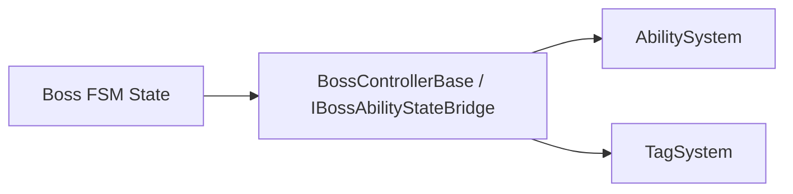
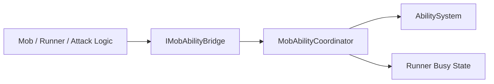

# AI / FSM Ability Integration Review

이 문서는 현재 프로젝트에서 AI/FSM가 `AbilitySystem`, `TagSystem`, 버프/디버프 구조와 어떻게 연결되어 있는지 조사한 결과를 정리합니다.

목표는 두 가지입니다.

- 이미 사실상 표준처럼 쓰이고 있는 **공식 연결 경로**를 식별한다.
- 아직 개별 스크립트가 직접 `AbilitySystem` / `TagSystem`을 호출하는 **비공식 연결 경로**를 식별한다.

---

## 결론 요약

- **보스 FSM 쪽은 이미 bridge 기반 공식 경로가 꽤 잘 잡혀 있습니다.**
  - `BossControllerBase`
  - `IBossAbilityStateBridge`
  - `BossPatternRuntimeState`
- **일반 몬스터 쪽은 coordinator 기반 공식 경로가 있지만, 일부 특수 공격 스크립트와 BT 액션이 직접 호출을 섞고 있습니다.**
  - `MobAbilityCoordinator`
  - `IMobAbilityBridge`
- 따라서 다음 단계는
  - 보스 쪽 표준을 문서상으로 고정하고
  - 일반 몬스터/BT 쪽 direct call을 coordinator/bridge 쪽으로 정리하는 것입니다.

---

## 조사 범위

이번 조사에서는 아래 계층을 기준으로 연결 상태를 확인했습니다.

- 보스 FSM
- 일반 몬스터 공격 루프
- Behavior Tree GAS 액션
- 직접 `AbilitySystem` / `TagSystem`을 만지는 특수 공격 스크립트

대표적으로 확인한 파일은 다음과 같습니다.

- [BossControllerBase.cs](C:/HMS/AboutCapstoneProject/CapstoneProject/CapstoneProject/Assets/Script/Enemy/Boss/FSM/Core/BossControllerBase.cs)
- [IBossAbilityStateBridge.cs](C:/HMS/AboutCapstoneProject/CapstoneProject/CapstoneProject/Assets/Script/Enemy/Boss/FSM/Core/IBossAbilityStateBridge.cs)
- [BossPatternExecuteState.cs](C:/HMS/AboutCapstoneProject/CapstoneProject/CapstoneProject/Assets/Script/Enemy/Boss/FSM/States/BossPatternExecuteState.cs)
- [MobAbilityCoordinator.cs](C:/HMS/AboutCapstoneProject/CapstoneProject/CapstoneProject/Assets/Script/Enemy/Mob/MobAbilityCoordinator.cs)
- [IMobAbilityBridge.cs](C:/HMS/AboutCapstoneProject/CapstoneProject/CapstoneProject/Assets/Script/Enemy/Mob/IMobAbilityBridge.cs)
- [ShadowServant.cs](C:/HMS/AboutCapstoneProject/CapstoneProject/CapstoneProject/Assets/Script/Enemy/Mob/ShadowServant/ShadowServant.cs)
- [StrangeCandlestick.cs](C:/HMS/AboutCapstoneProject/CapstoneProject/CapstoneProject/Assets/Script/Enemy/Mob/StrangeCandlestick/StrangeCandlestick.cs)
- [GAS_Actions.cs](C:/HMS/AboutCapstoneProject/CapstoneProject/CapstoneProject/Assets/Script/Enemy/Boss/Behavior/GAS_Actions.cs)
- [TackleAttack.cs](C:/HMS/AboutCapstoneProject/CapstoneProject/CapstoneProject/Assets/Script/Enemy/Mob/TackleAttack.cs)

---

## 현재 공식 연결 경로

### 1. 보스 FSM -> BossControllerBase -> AbilitySystem

현재 보스 FSM은 비교적 좋은 형태로 정리되어 있습니다.

- FSM state는 보통 `BossControllerBase`를 통해 능력 실행을 요청합니다.
- `BossControllerBase`는 `IBossAbilityStateBridge`를 구현해, state 쪽이 `AbilitySystem`과 `TagSystem`의 세부 구현을 직접 몰라도 되게 합니다.

대표 흐름:

이 경로의 장점:

- state 코드가 `AbilitySystem.TryActivateAbility(...)`를 직접 몰라도 됩니다.
- `IsAbilityExecutionBusy`, `HasStateTag(...)`, `CancelActiveAbility(...)` 같은 공통 질의를 bridge가 제공합니다.
- 패턴 실행 흐름과 ASC 실행 흐름이 `BossControllerBase`에서 만납니다.

판단:

- **이 경로는 공식 경로로 봐도 좋습니다.**

---

### 2. 일반 몬스터 -> MobAbilityCoordinator -> AbilitySystem

일반 몬스터 쪽은 `MobAbilityCoordinator`와 `IMobAbilityBridge`가 공식 경로 역할을 하고 있습니다.

대표 흐름:

이 경로의 장점:

- AI가 `AbilitySystem.IsBusy`와 runner 실행 상태를 한 번에 볼 수 있습니다.
- 특수 attack runner가 있어도 busy 판정이 coordinator로 모입니다.
- `TryStartAbility(...)`, `CancelActiveAbility(...)` 같은 최소 계약이 이미 존재합니다.

실제 대표 사례:

- [ShadowServant.cs](C:/HMS/AboutCapstoneProject/CapstoneProject/CapstoneProject/Assets/Script/Enemy/Mob/ShadowServant/ShadowServant.cs)
- [StrangeCandlestick.cs](C:/HMS/AboutCapstoneProject/CapstoneProject/CapstoneProject/Assets/Script/Enemy/Mob/StrangeCandlestick/StrangeCandlestick.cs)

판단:

- **이 경로도 공식 경로로 승격할 수 있는 상태입니다.**

---

## 현재 비공식 연결 경로

### 1. Behavior Tree GAS 액션이 AbilitySystem / TagSystem을 직접 호출

[GAS_Actions.cs](C:/HMS/AboutCapstoneProject/CapstoneProject/CapstoneProject/Assets/Script/Enemy/Boss/Behavior/GAS_Actions.cs)는 현재 다음을 직접 수행합니다.

- `GetComponent<AbilitySystem>()`
- `abilitySystem.TryActivateAbility(...)`
- `OnAbilityCastCompleted / Cancelled` 직접 구독
- `GetComponent<TagSystem>()`
- `tagSystem.HasTag(...)`

이 구조의 문제:

- BT 액션 노드가 ASC/태그 시스템의 구체 구현에 직접 결합됩니다.
- 보스 FSM 쪽처럼 bridge 경계가 없습니다.
- 같은 프로젝트 안에서 보스 FSM은 bridge를 쓰고, BT는 direct call을 쓰는 **이중 규칙**이 됩니다.

판단:

- **비공식 경로**
- 향후 정리 우선순위가 높은 영역

---

### 2. 특수 공격 스크립트가 AbilitySystem / TagSystem을 직접 조작

[TackleAttack.cs](C:/HMS/AboutCapstoneProject/CapstoneProject/CapstoneProject/Assets/Script/Enemy/Mob/TackleAttack.cs)는 현재 다음을 직접 수행합니다.

- `abilitySystem.TryActivateAbility(...)`
- `abilitySystem.GetCooldownRemaining(...)`
- `abilitySystem.TrySetCooldownRemaining(...)`
- `abilitySystem.FindSpec(...)`
- `tagSystem.AddTag(...)`
- `tagSystem.RemoveTag(...)`

이 구조의 문제:

- 공격 가능 여부 판단, 경고, 능력 실행, 쿨다운, 태그 부여가 한 스크립트에 모입니다.
- `MobAbilityCoordinator`가 이미 있는데도 busy/실행 경로가 우회됩니다.
- 일반 몬스터 표준 경로와 다른 예외 규칙이 생깁니다.

판단:

- **비공식 경로**
- 추후 `IMobAbilityBridge` / 별도 state bridge / coordinator helper 쪽으로 정리할 후보

---

## 경계가 애매하지만 허용 가능한 연결

### 1. 런타임 AbilityDefinition 생성 및 GiveAbility

[ShadowServant.cs](C:/HMS/AboutCapstoneProject/CapstoneProject/CapstoneProject/Assets/Script/Enemy/Mob/ShadowServant/ShadowServant.cs)와
[StrangeCandlestick.cs](C:/HMS/AboutCapstoneProject/CapstoneProject/CapstoneProject/Assets/Script/Enemy/Mob/StrangeCandlestick/StrangeCandlestick.cs)는 초기화 단계에서 runtime ability definition을 만들고 `abilitySystem.GiveAbility(...)`를 호출합니다.

이건 direct call이긴 하지만 성격이 다릅니다.

- **런타임 실행 경로**가 아니라
- **초기화 / 등록 경로**에 가깝기 때문입니다.

즉 다음처럼 구분하는 게 좋습니다.

- 능력 **등록/세팅**
  - direct call 허용 가능
- 능력 **실행/취소/상태 조회**
  - 공식 bridge/coordinator 경로 사용

판단:

- **즉시 정리 대상은 아님**
- 다만 “초기화 direct call”과 “실행 direct call”은 문서상으로 구분해야 합니다.

---

## 공식 연결과 비공식 연결 맵

| 영역 | 현재 연결 | 상태 |
| --- | --- | --- |
| 보스 FSM -> GAS | `BossControllerBase` / `IBossAbilityStateBridge` | 공식 |
| 일반 몬스터 AI -> GAS | `MobAbilityCoordinator` / `IMobAbilityBridge` | 공식 |
| BT Action -> GAS | `GAS_Actions.cs` direct call | 비공식 |
| 특수 공격 MonoBehaviour -> GAS | `TackleAttack.cs` direct call | 비공식 |
| 런타임 능력 등록 | 각 몬스터 init 시 `GiveAbility(...)` | 조건부 허용 |

---

## 현재 구조의 문제 요약

현재 프로젝트는 “AI/FSM와 GAS 연결”이 완전히 비정리 상태는 아닙니다.

문제는 오히려:

- **표준 경로가 이미 일부 존재하는데**
- 그 바깥에서 direct call이 섞여 있다는 점입니다.

즉 지금 필요한 건 완전한 신규 발명이 아니라,

- 이미 있는 `BossControllerBase`
- 이미 있는 `MobAbilityCoordinator`

이 두 축을 **공식 코어 계약으로 승격**시키고, direct call 영역을 점진적으로 흡수하는 일입니다.

---

## 추천 방향

### 1. “직접 ASC 호출 가능 범위”를 문서로 고정

다음 원칙을 기준으로 삼는 것이 좋습니다.

- `AbilitySystem.TryActivateAbility(...)` 직접 호출
  - 허용: coordinator / boss controller / 초기화 등록 계층
  - 지양: BT action, 개별 공격 MonoBehaviour, FSM state

- `TagSystem.HasTag(...)` 직접 조회
  - 허용: bridge / controller / 효과 소비자
  - 지양: AI state가 매번 직접 `GetComponent<TagSystem>()`

---

### 2. BT 전용 bridge/coordinator 경로를 열어준다

`GAS_Actions.cs`는 당장 제거하기보다, 다음 같은 경로로 옮기는 게 좋아 보입니다.

- BT node -> `IBossAbilityStateBridge`
- 또는 BT node -> 별도 `IAIAbilityBridge`

핵심은:

- BT 노드가 `AbilitySystem`을 직접 만지지 않게 하는 것

입니다.

---

### 3. 특수 공격 스크립트는 “문맥 생성”과 “실행 요청”을 분리

`TackleAttack.cs` 같은 스크립트는 다음처럼 역할을 줄이는 쪽이 좋습니다.

- 공격 가능 여부 판단
- 태클 문맥 생성
- 경고 표시

까지만 맡고,

- 실제 ability 실행
- 쿨다운 조작
- tag 부여

는 bridge/coordinator/helper가 맡도록 옮겨가는 방식입니다.

---

## 다음 설계 질문

다음 단계에서 꼭 결정해야 할 질문은 이겁니다.

1. BT는 boss bridge를 재사용할 것인가, 별도 AI bridge를 둘 것인가?
2. 일반 몬스터 특수 공격 스크립트는 coordinator만으로 충분한가, 추가 helper가 필요한가?
3. “능력 등록 초기화”와 “능력 실행 요청”은 어떤 클래스가 각각 책임져야 하는가?
4. AI/FSM가 읽는 상태는 tag를 직접 볼 것인가, bridge 질의 API로 제한할 것인가?

---

## 한 줄 결론

현재 AI/FSM와 GAS 연결은 다음처럼 정리할 수 있습니다.

- **보스 FSM 경로는 이미 공식화되어 있다.**
- **일반 몬스터도 coordinator 경로가 있다.**
- 하지만 **BT 액션과 일부 특수 공격 스크립트는 아직 direct call 기반 비공식 연결**이다.

다음 작업의 목표는:

- 이미 있는 공식 경로를 코어 계약으로 명시하고
- 비공식 direct call을 그 계약 안으로 점진적으로 흡수하는 것

입니다.
