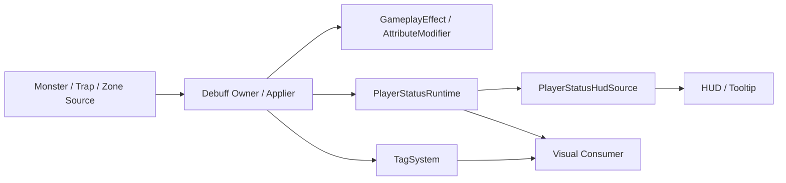

# Gameplay Debuff Application Architecture

이 문서는 **몬스터/환경이 플레이어에게 거는 디버프의 공통 적용 경로**를 정리합니다.

목표는 다음과 같습니다.

- 디버프가 늘어나도 같은 적용 흐름을 반복할 수 있어야 한다
- 실제 효과, 존재 플래그, HUD/tooltip이 서로 엇갈리지 않아야 한다
- 기존 `AbilitySystem / GameplayEffect / TagSystem`을 살리고, 중복 시스템을 만들지 않아야 한다
- `ShadowFog` 같은 현재 사례를 레거시/과도기와 목표 구조로 분리해서 볼 수 있어야 한다

## 현재 상황

현재 프로젝트는 이미 다음 계층을 가지고 있습니다.

- `GameplayEffect / AttributeModifier`
  - 실제 감속, 피해 증가, 약화 같은 gameplay 효과를 적용한다
- `TagSystem`
  - 상태 존재 플래그를 저장하고 count를 추적한다
- `PlayerStatusRuntime`
  - HUD/tooltip용 활성 상태 목록과 handle 수명을 관리한다
- `PlayerStatusHudSource`
  - `PlayerStatusRuntime`을 HUD 엔트리로 투영한다
- `GlobalVisionMaskController`
  - 시야 제한 연출을 소비한다

즉 핵심 문제는 "새 디버프 시스템을 만들 것인가"가 아니라,
**기존 계층을 어떤 순서와 책임선으로 묶어서 공통 디버프 적용 경로로 사용할 것인가**입니다.

## 핵심 원칙

### 1. 새 버프 시스템을 만들지 않는다

플레이어 디버프의 실제 gameplay 효과는 계속 기존 경로를 사용합니다.

- `GameplayEffect`
- `AttributeModifier`
- `AbilitySystem` 기반 effect 적용 경로

`PlayerStatusRuntime`는 새 효과 시스템이 아니라,
**상태 표시/수명 허브**로만 동작해야 합니다.

### 2. 존재 여부는 tag, 표시/수명은 status entry

디버프가 활성인지 빠르게 판정하는 건 `TagSystem`이 더 적합합니다.

- 상태 존재 여부
- 다른 시스템의 분기
- 연출/판정 조건

반면 HUD/tooltip에는 다음 값이 필요합니다.

- 남은 시간
- 스택
- owner/source 식별
- 표시 정의

이 값은 `PlayerStatusRuntime`의 활성 상태 entry가 관리합니다.

즉 디버프는 기본적으로:

- `TagSystem` = 존재 플래그
- `PlayerStatusRuntime` = HUD/tooltip용 수명 데이터

로 나뉩니다.

### 3. 디버프 owner가 세 계층을 함께 관리한다

디버프 하나가 제대로 동작하려면 아래 세 계층이 같은 수명으로 움직여야 합니다.

1. 실제 효과 (`GameplayEffect / AttributeModifier`)
2. 존재 플래그 (`TagSystem`)
3. 표시/수명 (`PlayerStatusRuntime`)

이 세 가지를 각 계층이 따로 해석하면 어긋나기 쉽습니다.

따라서 디버프를 시작한 owner가 아래를 함께 관리해야 합니다.

- effect 적용
- tag 부여/회수
- `PlayerStatusRuntime.Apply/Update/Release`

## 표준 디버프 적용 경로

앞으로 플레이어 디버프는 아래 순서를 기본 경로로 삼습니다.

1. **source가 대상 플레이어를 확정한다**
   - 예: 몬스터 공격, 장판, 환경 트리거
2. **기존 gameplay 효과 경로로 실제 효과를 적용한다**
   - `GameplayEffectRunner.ApplyEffectSpec(...)`
   - 또는 기존 effect/attribute modifier 경로
3. **같은 owner가 상태 존재를 tag로 보장한다**
   - 가능하면 effect가 granted tag를 함께 부여
   - 필요 시 owner가 `TagSystem`을 직접 조정
4. **같은 owner가 `PlayerStatusRuntime.Apply/Update/Release`를 호출한다**
   - HUD/tooltip은 여기서 수명을 본다

한 줄로 요약하면:

**effect 적용 -> tag 보장 -> HUD 상태 등록**

입니다.

## 각 계층의 책임

### source owner

예:

- 몬스터 디버프 applier
- 장판/트랩 디버프 컴포넌트
- 환경 디버프 controller

책임:

- 대상 플레이어 확정
- effect 적용
- tag 보장
- `PlayerStatusRuntime` handle 관리

source owner는 디버프 적용 경로의 **오케스트레이터**입니다.

### `GameplayEffect / AttributeModifier`

책임:

- 실제 gameplay 결과 적용
- 감속, 피해 증가, 약화 같은 효과 반영

이 계층은 HUD나 tooltip을 몰라야 합니다.

### `TagSystem`

책임:

- 상태 존재 여부 저장
- count 관리
- 빠른 분기/질의 지원

중요한 점:

- `TagSystem`은 태그 저장소입니다
- `PlayerStatusRuntime`가 태그 저장을 복제하면 안 됩니다

### `PlayerStatusRuntime`

책임:

- 상태 entry apply/update/release
- owner handle 수명 관리
- HUD/tooltip이 읽을 현재 상태 목록 제공
- 필요 시 `TagSystem` 조정 보조

중요한 점:

- `PlayerStatusRuntime`는 실제 effect의 진실한 원천이 아닙니다
- 상태 표시와 owner 수명 관리를 위한 허브입니다

### `PlayerStatusHudSource`

책임:

- `PlayerStatusRuntime` entry를 HUD 엔트리로 투영

중요한 점:

- HUD는 중복/병합/갱신 정책을 해석하지 않습니다
- 상태 관리 계층이 확정한 최종 결과만 표시합니다

### 연출 소비자

예:

- `GlobalVisionMaskController`

책임:

- tag 또는 최종 상태 결과를 읽어서 연출을 적용

중요한 점:

- 연출 소비자는 effect/HUD 수명을 직접 소유하지 않습니다

## 무기/유물 상태와 플레이어 디버프의 차이

무기/유물 상태는 owner가 명확하고,
owner가 시작/갱신/종료를 거의 전부 압니다.

예:

- 무기 stance
- 무기 스택
- 유물 proc 내부 시간/스택

이런 상태는 owner가 직접 소유하고, 필요하면 직접 HUD에 투영하는 편이 낫습니다.

반면 플레이어 디버프는:

- source가 따로 있고
- 실제 효과는 기존 effect 계층이 적용하고
- 존재 여부는 tag가 의미 있고
- HUD는 플레이어 상태 허브가 더 잘 다룹니다

즉 플레이어 디버프는 **플레이어 중심 종합 상태**에 더 가깝습니다.

## `ShadowFog`와 `RestrictedVisionVisualController`에 대한 현재 판단

현재 `ShadowFog` 사례는 동작은 하지만 과도기 성격이 남아 있습니다.

### 현재 구조

- `ShadowFog`
  - 디버프 source
- `RestrictedVisionVisualController`
  - darkness 연출 요청
- `PlayerStatusRuntime`
  - HUD 상태 허브

### 왜 과도기인가

현재는 공통 디버프 apply 경로와 시야 차단 전용 연출 브리지가 함께 존재합니다.

즉 구조는 많이 정리됐지만,
- `ShadowFog`가 아직 첫 구현 사례이고
- 시야 차단 연출은 별도 브리지로 남아 있어
완전히 일반화된 단계라기보다 **검증된 1차 구조**에 가깝습니다.

### 현재 기준

- `RestrictedVisionVisualController`는 **새 디버프 구현의 표준 패턴이 아니다**
- 새 디버프는 가능하면 `effect 적용 -> tag 보장 -> HUD 상태 등록` 경로를 직접 따르는 owner를 만든다
- `RestrictedVisionVisualController`는 시야 차단 연출에 한정된 보조 브리지로 간주한다

## 구현 사례: `ShadowFog`

현재 `ShadowFog`는 공통 디버프 적용 구조의 첫 구현 사례입니다.

- `ShadowFog`
  - source owner
  - 플레이어 대상 확정
- `CombatBuffDebuffApplier`
  - `GameplayEffect` 적용
  - 결과 조회
  - 플레이어 대상이면 `PlayerStatusRuntime` sync
- `RestrictedVisionVisualController`
  - 시야 차단 연출만 담당

즉 `ShadowFog`는 이제:

- **effect/HUD 동기화는 공통 경로**
- **시각 효과만 전용 브리지**

로 정리된 사례라고 볼 수 있습니다.

## 목표 구조

이 문서가 지향하는 목표 구조는 다음과 같습니다.

핵심은:

- source owner가 디버프 수명을 묶어서 관리하고
- 실제 효과, 존재 플래그, HUD 상태는 각자 자기 책임을 수행하며
- HUD와 연출은 결과를 소비한다

입니다.

## 씬 전환 규칙

몬스터 source 디버프는 기본적으로 **재등록 모델보다 회수 모델**에 가깝습니다.

이유:

- source owner가 씬과 함께 사라질 수 있다
- 다음 씬에서 같은 owner가 다시 존재한다는 보장이 없다

따라서 씬 전환 시 기본 규칙은:

- owner 소멸
- effect 정리
- tag 회수
- `PlayerStatusRuntime` handle release

입니다.

반면 유물/환경 상태는 여전히 **owner 재등록 모델**이 더 자연스럽습니다.

## 중복 디버프 정책

중복 디버프 정책은 HUD가 결정하지 않습니다.

예:

- 같은 디버프 refresh
- 스택 증가
- 더 강한 값으로 교체
- source별 독립 유지

이런 규칙은 상태 관리 계층, 즉 디버프 owner / 디버프 관리자 쪽에서 먼저 확정해야 합니다.

HUD는 최종 결과만 표시합니다.

## 구현 기준 체크리스트

새 디버프를 만들 때는 아래 질문을 먼저 확인합니다.

1. 이 디버프의 실제 효과는 기존 `GameplayEffect / AttributeModifier` 경로로 충분한가
2. 다른 시스템이 존재 여부를 tag로 빠르게 봐야 하는가
3. HUD에 필요한 값은 `remainingTime / stackCount / ownerKey` 정도인가
4. owner가 effect, tag, HUD 상태를 함께 관리할 수 있는가
5. 이 source는 씬과 함께 사라지는가
   - 그렇다면 재등록보다 회수 모델이 맞는가
6. 현재 특수 컴포넌트가 너무 많은 책임을 들고 있지는 않은가

## 한 줄 결론

플레이어 디버프의 공통 적용 경로는:

- **기존 gameplay effect 경로를 유지하고**
- **tag는 존재 플래그로 쓰며**
- **`PlayerStatusRuntime`는 HUD/수명 허브로 제한하고**
- **디버프 owner가 세 계층(effect/tag/HUD)을 함께 관리하는 구조**

가 가장 적절합니다.
