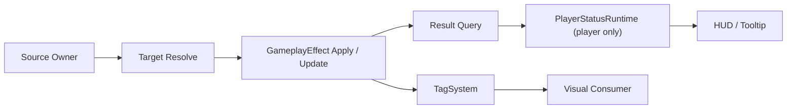

# Gameplay Buff / Debuff Architecture

이 문서는 현재 프로젝트에서 **버프/디버프를 어떤 계층으로 나눠서 적용하고 표시할지**를 정리합니다.

목표는 다음과 같습니다.

- 실제 gameplay 효과, 존재 여부, HUD 표시가 서로 엇갈리지 않게 한다
- 기존 `AbilitySystem / GameplayEffect / TagSystem`을 그대로 활용한다
- 플레이어 전용 구조와 전투 대상 공통 구조를 구분한다
- 중첩/갱신 정책이 HUD가 아니라 효과 적용 계층에서 결정되게 한다

## 한 줄 요약

현재 프로젝트에서 버프/디버프의 기본 구조는 다음과 같습니다.

- **실질 효과 + 존재 tag + 중첩 규칙**
  - `GameplayEffect`
- **HUD/tooltip 표시**
  - 플레이어 대상이면 `PlayerStatusRuntime`
- **적용 시작점**
  - source owner

즉 기본 원칙은:

**GE가 효과와 존재를 책임지고, HUD는 GE 결과를 표시한다**

입니다.

## 왜 이 구조를 택하나

프로젝트는 이미 다음 계층을 가지고 있습니다.

- `AbilitySystem`
- `GameplayEffectRunner`
- `GameplayEffect`
- `TagSystem`
- `PlayerStatusRuntime`
- `PlayerStatusHudSource`

따라서 새 버프 시스템을 만드는 것보다,
기존 effect/tag 계층을 중심으로 버프/디버프를 정리하는 편이 더 적절합니다.

특히:

- `GameplayEffect`는 실제 수치 효과를 적용하고
- granted tag로 상태 존재를 함께 표현할 수 있으며
- `PlayerStatusRuntime`는 HUD/tooltip 수명만 맡게 할 수 있습니다

이 조합이 가장 중복이 적고 안정적입니다.

## 계층별 책임

### 1. `GameplayEffect`

책임:

- 실제 gameplay 효과 적용
- 상태 존재 tag 부여/회수
- 같은 effect 재적용 시 중첩/갱신 규칙의 진실한 원천

예:

- 이동속도 감소
- 받는 피해 증가
- 방어력 감소
- 시야 제한 상태 존재 tag

### 2. `TagSystem`

책임:

- 현재 상태 존재 여부를 저장
- count를 추적
- 다른 시스템이 빠르게 분기할 수 있게 함

중요:

- 태그 저장소는 `TagSystem`
- `PlayerStatusRuntime`가 태그 저장소를 복제하지 않음

### GE가 tag까지 같이 책임지는 경우

대부분의 버프/디버프는 `GameplayEffect`가 granted tag를 함께 부여하는 방식으로 가는 것이 더 좋습니다.

즉 기본값은:

- `GameplayEffect`
  - 실제 효과
  - 상태 존재 tag

로 함께 묶고,

- `PlayerStatusRuntime`
  - HUD/tooltip 표시

만 별도로 두는 편이 안전합니다.

이렇게 하면 owner가 tag를 따로 `Add/Remove`하는 필요가 크게 줄고,
effect와 존재 플래그가 같은 수명으로 움직입니다.

### 3. `PlayerStatusRuntime`

책임:

- 플레이어에게 보여줄 상태의 HUD/tooltip 수명 관리
- owner handle 기반 apply/update/release
- HUD가 읽을 활성 상태 entry 제공

중요:

- 실제 효과의 진실한 원천은 아님
- 플레이어 HUD/tooltip용 **표시 허브**

### 4. `PlayerStatusHudSource`

책임:

- `PlayerStatusRuntime` entry를 HUD에 projection

중요:

- 중첩/갱신 정책을 해석하지 않음
- 상태 관리 계층이 확정한 결과만 표시

### 5. source owner

예:

- 몬스터 공격 proc
- 장판/트랩
- 환경 상태 owner
- 유물 proc

책임:

- 대상 확정
- 어떤 GE를 적용할지 결정
- 필요 시 HUD 상태도 함께 갱신

즉 source owner는 **버프/디버프 적용의 시작점**입니다.

## 표준 적용 흐름

기본 흐름은 다음과 같습니다.

```text
Source Owner
-> target resolve
-> GameplayEffect apply/update
-> GE 결과 조회
-> (target이 player면) PlayerStatusRuntime apply/update
```

즉 중요한 점은:

- HUD가 effect를 대체하지 않는다
- HUD는 effect가 만든 최종 결과를 표시한다

입니다.

## 표준 연결 경로

버프/디버프 구현에서 가장 중요한 기준은 다음 한 줄입니다.

> **GE 적용 후 `PlayerStatusRuntime`까지 이어지는 경로를 source owner마다 따로 만들지 않고, 하나의 표준 apply 경로로 묶는다.**

즉 source owner는 가능하면:

- 대상을 찾고
- 어떤 버프/디버프 정의를 쓸지 고르고
- 공용 apply 경로를 호출

까지만 맡는 편이 좋습니다.

예시 이름:

- `CombatBuffDebuffApplier`
- 또는 `ApplyBuffOrDebuff(...)`

이 공용 경로는 다음을 한 번에 맡습니다.

1. `GameplayEffect` 적용 또는 갱신
2. 적용 성공 여부 확인
3. 남은 시간 / stack / sourceKey 같은 결과 조회
4. 대상이 플레이어라면 `PlayerStatusRuntime.Apply/Update/Release`

즉:

```text
Source Owner
-> CombatBuffDebuffApplier.Apply(...)
   -> GE apply/update
   -> result query
   -> (player only) PlayerStatusRuntime sync
```

이게 현재 문서가 지향하는 표준 연결 경로입니다.

## "Result Query"의 의미

위 흐름의 `GE 결과 조회`는 추상적인 개념이 아니라, 다음 값을 뜻합니다.

- effect가 실제로 적용되었는가
- 같은 effect가 이미 활성 상태였는가
- 갱신 후 남은 시간이 얼마인가
- 갱신 후 stack 수가 얼마인가
- sourceObject 구분이 필요한가

즉 HUD는 effect 결과를 다시 추론하지 않고,
**effect 적용 계층이 확정한 결과값만 받아서 표시**해야 합니다.

## 플레이어 전용 표시와 전투 대상 공통 구조

버프/디버프 자체는 전투 대상 공통 구조로 생각하는 편이 좋습니다.

- 플레이어
- 몬스터
- 소환수

모두 같은 GE 경로를 탈 수 있어야 합니다.

다만 HUD/tooltip은 현재 플레이어 전용입니다.

즉:

- **디버프 구조는 공통**
- **HUD 표시만 플레이어 특화**

로 보는 것이 맞습니다.

그래서 어떤 디버프는:

- 플레이어만 적용
- 몬스터도 적용
- 둘 다 적용

될 수 있고,

이 차이는 **source의 타겟 필터**가 결정합니다.

## 특수한 플레이어 전용 디버프

예: 시야 제한

이런 디버프도 공통 구조를 따르되, 실제 적용 대상은 플레이어로 제한할 수 있습니다.

방법:

- 충돌 레이어/필터를 플레이어만 잡는다
- 플레이어에게만 GE 적용
- 플레이어니까 `PlayerStatusRuntime`에도 상태 표시 등록

즉:

- 구조는 공통
- 적용 대상만 플레이어 전용

입니다.

## 무기/유물 상태와의 경계

모든 상태를 플레이어 상태 시스템으로 올리는 건 권장하지 않습니다.

### owner가 직접 소유하는 것이 더 좋은 상태

예:

- 무기 stance
- 무기 스택
- pair interaction 상태
- 유물 proc 내부 스택/시간

이런 건 owner가 직접 소유하고, 필요하면 owner가 직접 HUD에 투영하는 편이 더 자연스럽습니다.

### 플레이어 상태 시스템에 올릴 가치가 있는 상태

예:

- 몬스터 디버프
- 환경 디버프
- 플레이어 전역 버프
- 여러 시스템이 공통으로 읽어야 하는 효과

이런 상태는 플레이어 중심 상태 허브에 올라가는 게 적절합니다.

한 줄 기준:

- **owner의 전투 문법이면 owner가 직접 소유**
- **플레이어 전역 효과면 `PlayerStatusRuntime`에 올림**

## 중첩/갱신 정책

이제 중요한 건 **tag가 아니라 GE 중첩 정책**입니다.

같은 디버프가 다시 들어올 때 가능한 정책 예시는:

- `RefreshDuration`
- `AddStack`
- `ReplaceIfStronger`
- `IgnoreIfAlreadyApplied`

중요:

- 이 정책은 HUD가 결정하지 않습니다
- `GameplayEffect` 또는 디버프 적용 계층이 먼저 결정합니다

즉:

- HUD는 "최종 남은 시간/최종 스택/최종 강도"만 표시
- 중첩 규칙은 effect 적용 계층이 책임

### 현재 구현과 설계 목표를 구분해야 한다

위 정책 목록은 현재 문서 기준으로 **설계 목표**입니다.

즉:

- 모든 정책이 현재 `GameplayEffect` 구현에 이미 완비되어 있다는 뜻은 아닙니다
- 어떤 정책이 기존 `GameplayEffectRunner`에서 바로 가능한지,
- 어떤 정책은 effect 자산이나 적용 계층 보강이 필요한지는 별도로 확인해야 합니다

현재 기준으로는:

- `RefreshDuration`
  - 가장 먼저 검토할 기본 정책
- `AddStack / ReplaceIfStronger / IgnoreIfAlreadyApplied`
  - 현재 effect/runner 지원 여부를 확인해야 하는 확장 정책

으로 보는 편이 안전합니다.

### 복수 source의 동일 effect

같은 버프/디버프를 서로 다른 source가 동시에 적용할 수 있는 경우,
다음 질문이 반드시 함께 결정되어야 합니다.

- 같은 GE가 source별 독립 인스턴스로 유지되는가
- 같은 GE는 하나만 유지되고 더 긴/더 강한 결과로 갱신되는가
- source A가 사라질 때 source A의 인스턴스만 정리되는가

이 규칙은 HUD가 아니라 **effect 적용/관리 계층**이 먼저 결정합니다.

특히 source 종속형 효과는:

- source별 독립 인스턴스
- source별 회수

가 필요한 경우가 많습니다.

## source 종속형 / 비종속형 디버프

디버프는 수명 정책도 나뉩니다.

### source 종속형

예:

- 오라형 약화
- 장판 유지형 디버프
- `ShadowFog` 같은 접촉 유지형 효과

특징:

- source가 살아 있을 때만 의미가 있음
- source가 죽거나 사라지면 회수

### source 비종속형

예:

- 독
- 출혈
- 저주

특징:

- 한 번 걸리면 source가 죽어도 유지
- duration 만료까지 대상 위에서 계속 유지

중요:

- 이건 예외처리가 아니라 **수명 정책 차이**

로 보는 게 좋습니다.

### HUD 타이머 갱신 경로

현재 기준으로 HUD의 남은 시간은 **effect 적용 결과를 알고 있는 계층이 직접 `PlayerStatusRuntime.Update(...)`를 호출해서 동기화**하는 모델이 가장 안전합니다.

즉 기본값은:

- `PlayerStatusRuntime`가 effect를 매 프레임 폴링하지 않는다
- source owner 또는 공용 apply 경로가
  - effect 갱신 결과
  - 남은 시간
  - stack
  을 알고 있을 때 `Update(...)`를 호출한다

이 원칙은 유물 시간형 상태에서 이미 쓰고 있는 패턴과도 일치합니다.

### 씬 전환 시 source 비종속형 효과

독/출혈처럼 source가 죽어도 유지되는 효과는,
씬 전환 시에는 별도 저장/회수 정책이 필요합니다.

즉:

- "source가 죽어도 유지"와
- "씬이 바뀌어도 유지"

를 같은 의미로 취급하면 안 됩니다.

현재 문서 기준 기본값은 아직 고정하지 않았고,
이 축은 `RuntimeSaveArchitecture`와 연결해서 따로 판단해야 합니다.

## 현재 `ShadowFog` 사례에 대한 판단

현재 `ShadowFog`는 동작하지만, 구조적으로는 과도기 성격이 일부 남아 있습니다.

현재 흐름:

- `ShadowFog`
- `RestrictedVisionVisualController`
- `PlayerStatusRuntime`
- `GlobalVisionMaskController`

아쉬운 점:

- 시야 차단 연출 브리지가 일반적인 디버프 연출 소비자 계층으로 아직 완전히 일반화되지는 않음
- `ShadowFog`는 첫 구현 사례라서 구조를 검증하는 의미가 더 크고, 아직 후속 사례가 부족함

판단:

- `RestrictedVisionVisualController`는 신규 디버프의 표준 패턴이 아니라, 시야 차단 연출에 한정된 브리지로 본다
- 장기적으로는 더 일반화된 디버프 연출 소비자 계층으로 흡수될 수 있다

즉 `ShadowFog`는 지금도 유효한 사례이긴 하지만,
**"현재 동작하는 과도기 사례"**로 읽어야 하며
새 효과는 가능하면 공용 apply 경로를 먼저 따르는 쪽으로 만드는 것이 좋습니다.

## 구현 사례: `ShadowFog`

현재 `ShadowFog`는 공통 버프/디버프 적용 경로의 첫 구현 사례입니다.

적용 흐름:

1. `ShadowFog`가 플레이어 충돌 대상을 확정한다
2. 대상 플레이어 루트에 `CombatBuffDebuffApplier`를 확보한다
3. `CombatBuffDebuffApplier`가 `GE_ShadowFogRestrictedVision`을 적용한다
4. 같은 경로에서 플레이어 대상이면 `PlayerStatusRuntime`에 `SHD_ShadowFogRestrictedVision` 결과를 동기화한다
5. `RestrictedVisionVisualController`는 시야 차단 연출만 담당한다

즉 이 사례는:

- **실질 효과와 HUD 동기화는 공통 apply 경로**
- **시야 차단 연출만 전용 visual controller**

로 책임이 갈라진 첫 사례로 보면 됩니다.

## 앞으로의 공통 구조 목표

지향하는 모습은 이렇습니다.



핵심은:

- 실제 효과와 존재는 GE가 책임지고
- HUD는 결과를 표시하며
- 연출은 tag/상태를 소비한다

는 점입니다.

## 구현 전 점검 질문

1. 이 버프/디버프의 실제 효과는 `GameplayEffect`로 표현 가능한가
2. 상태 존재 여부를 다른 시스템이 tag로 봐야 하는가
3. HUD에는 어떤 결과만 보여주면 되는가
   - 남은 시간
   - 스택
   - 표시 정의
4. 같은 effect 재적용 시 정책은 무엇인가
   - refresh / stack / replace / ignore
5. source가 죽어도 유지돼야 하는가
6. source가 씬과 함께 사라질 때, 이 효과는 회수 모델이 맞는가 저장/복원 모델이 맞는가
7. 플레이어에게만 표시하면 되는가
8. 현재 특수 컴포넌트가 너무 많은 책임을 들고 있지는 않은가

## 한 줄 결론

현재 프로젝트의 버프/디버프 구조는:

- **실질 효과 + 존재 tag는 `GameplayEffect` 중심**
- **HUD/tooltip은 `PlayerStatusRuntime`이 결과를 표시**
- **중첩/갱신 정책은 effect 적용 계층이 결정**
- **플레이어 전용 표시와 전투 대상 공통 효과를 분리**

로 정리하는 것이 가장 적절합니다.
