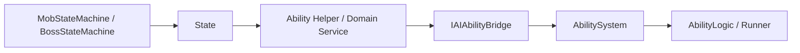

# Mob AI Architecture Direction Review

> Legacy / Review  
> 이 문서는 일반 몬스터 AI 상위 구조를 검토하기 위해 작성된 방향성 리뷰 문서입니다.  
> 현재 표준 구조는 관련 아키텍처 문서를 우선하고, 이 문서는 설계 판단의 배경과 이력을 확인하는 용도로 봅니다.

이 문서는 일반 몬스터 AI 구조를 다시 검토하면서 나온 논의를 정리합니다.

특히 다음 질문에 답하는 것이 목적입니다.

- 현재 일반 몬스터 AI는 실제로 어떤 흐름으로 동작하는가?
- `BT + helper + coordinator` 구조가 왜 실용적이면서도 조금 덜 "구조답게" 느껴지는가?
- 리팩토링 난이도를 제외하면, 일반 몬스터 AI의 이상적인 상위 구조는 무엇인가?

이 문서는 **BT 개인화 규칙 문서**가 아니라,  
**일반 몬스터 AI의 상위 구조 방향을 검토하는 문서**입니다.

관련 문서:

- [AI / FSM Ability Integration Review](./AIFSMAbilityIntegrationReview.md)
- [Personalized BT + Ability Structure Proposal](./PersonalizedBTAbilityStructureProposal.md)

---

## 결론 요약

- 현재 프로젝트에서 가장 **구조적인 공통 계층**은 `IAIAbilityBridge -> ASC` 라인입니다.
- 반면 `helper + personalized BT`는 아직 "구조"라기보다 **패턴 / 규칙 / 사례 묶음**에 더 가깝습니다.
- 리팩토링 난이도를 완전히 빼면, 일반 몬스터의 이상적인 상위 구조는 **BT보다 FSM 기반**이 더 낫다고 봅니다.
- 즉 최선의 구조는:
  - **보스도 FSM**
  - **일반 몬스터도 더 단순한 FSM**
  - 차이는 복잡도만 다르고, ASC 연결 구조는 공통 bridge를 사용

한 줄로 쓰면:

> **상위는 FSM, 중간은 helper, 하위는 bridge + ASC**

---

## 현재 일반 몬스터의 실제 실행 흐름

현재 일반 몬스터를 클래스 흐름으로 보면 크게 세 단계입니다.

### 1. AD 획득 및 ASC 등록

몬스터 본체가 자기 공격용 `AbilityDefinition`을 준비하고 `AbilitySystem`에 등록합니다.

대표 사례:

- [ShadowServant.cs](C:/HMS/AboutCapstoneProject/CapstoneProject/CapstoneProject/Assets/Script/Enemy/Mob/ShadowServant/ShadowServant.cs)
- [StrangeCandlestick.cs](C:/HMS/AboutCapstoneProject/CapstoneProject/CapstoneProject/Assets/Script/Enemy/Mob/StrangeCandlestick/StrangeCandlestick.cs)

흐름:

1. `Awake()`
   - `MobAbilityCoordinator` 확보
   - attack runner 확보
2. `Start()`
   - `EnsureAttackAbility()`
3. `EnsureAttackAbility()`
   - 이미 세팅된 AD가 있으면 `GiveAbility(...)`
   - 없으면 runtime AD/logic 생성 후 `GiveAbility(...)`

즉 이 단계는:

- "이 몬스터가 어떤 능력을 쓸 수 있는가"를 준비하고
- ASC에 등록하는 단계입니다.

---

### 2. 주변 정보 수집 및 상태 판단

그다음 helper나 몬스터 본체가 매 프레임 주변 상황을 읽습니다.

대표 사례:

- [TackleAttack.cs](C:/HMS/AboutCapstoneProject/CapstoneProject/CapstoneProject/Assets/Script/Enemy/Mob/TackleAttack.cs)
- [ShadowServant.cs](C:/HMS/AboutCapstoneProject/CapstoneProject/CapstoneProject/Assets/Script/Enemy/Mob/ShadowServant/ShadowServant.cs)
- [StrangeCandlestick.cs](C:/HMS/AboutCapstoneProject/CapstoneProject/CapstoneProject/Assets/Script/Enemy/Mob/StrangeCandlestick/StrangeCandlestick.cs)

여기서 보통 확인하는 것:

- 타겟 유효성
- 사거리
- 벽 / 경로
- 쿨다운
- runner / ASC busy
- 몬스터 고유 공격 규칙

즉 이 단계는:

- "지금 이 기술을 시도해도 되는가?"를 판단하는 단계입니다.

---

### 3. 능력 실행

실행은 helper/몬스터가 직접 ASC를 두드리지 않고 coordinator를 거칩니다.

중심 클래스:

- [MobAbilityCoordinator.cs](C:/HMS/AboutCapstoneProject/CapstoneProject/CapstoneProject/Assets/Script/Enemy/Mob/MobAbilityCoordinator.cs)

흐름:

1. helper가 `CanTryX()` / `TryBuildContext(...)`
2. helper가 `TryRequestX()`
3. 내부에서 `abilityCoordinator.TryStartAbility(...)`
4. coordinator가 `AbilitySystem.TryActivateAbility(...)`
5. runner / logic이 실제 시퀀스 수행

즉 현재 구조는 다음처럼 읽는 것이 가장 정확합니다.

```text
몬스터 본체/helper
-> MobAbilityCoordinator
-> AbilitySystem
-> AbilityLogic / Runner
```

---

## BT는 `new` 되는가?

현재 프로젝트에서 BT는 코드로 `new` 해서 조립하는 구조로 보이지 않습니다.

확인된 근거:

- [BG_Witch.asset](C:/HMS/AboutCapstoneProject/CapstoneProject/CapstoneProject/Assets/Script/Enemy/Boss/Behavior/Graph/BG_Witch.asset)

이 파일은 Unity Behavior graph asset이고, 내부에:

- `Blackboard`
- `m_RuntimeGraph`
- `Unity.Behavior.Start`

같은 정보가 들어 있습니다.

즉 현재 감각으로 보면:

- **BT는 asset**
- **어떤 runner/agent 성격의 컴포넌트가 그 asset을 실행**
- **coordinator는 BT 실행기가 아니라 ASC 연결 창구**

입니다.

---

## `IAIAbilityBridge`는 왜 구조처럼 느껴지는가?

`IAIAbilityBridge`는 helper나 personalized BT보다 훨씬 "구조답다"는 감각이 강합니다.

그 이유는:

- 몬스터 종류와 상관없이 공통 최소 문맥만 다루고
- 재사용성이 높고
- 역할이 분명하기 때문입니다.

예:

- `IsAbilityExecutionBusy`
- `TryStartAbility(...)`
- `CancelActiveAbility(...)`
- `HasStateTag(...)`

반대로 helper와 personalized BT는:

- 몬스터 고유 문맥
- 몬스터별 우선순위
- 능력별 특수 조건

을 담기 때문에, 구조라기보다 **패턴 / 사례 / 규칙**에 더 가까워집니다.

즉 현재 찜찜함은 아마 이 차이에서 옵니다.

- `IAIAbilityBridge`는 진짜 구조처럼 보임
- helper / personalized BT는 아직 구조라기보다 규칙처럼 보임

---

## 왜 `BT + helper + coordinator`가 덜 구조적으로 느껴지나

현재 일반 몬스터 쪽은 실용적으로는 굴러가지만, 개념상 다음처럼 보일 수 있습니다.

- 몬스터 본체
- personalized BT
- helper 컴포넌트
- coordinator
- attack runner
- ASC

즉 일반 몬스터 쪽에 **결정 / 문맥 / 실행 보조 계층이 여러 겹** 생깁니다.

반면 보스는 적어도 상위 언어가 더 선명합니다.

- FSM state
- bridge
- ASC

그래서 일반 몬스터가 더 단순해야 하는데도,
오히려 helper/BT/coordinator 조합이 더 복잡하게 느껴질 수 있습니다.

이 문서에서는 이 감각을 **타당한 구조 신호**로 봅니다.

---

## 리팩토링 난이도를 제외했을 때의 최선 구조

리팩토링 난이도를 완전히 제외하면, 저는 다음 구조가 가장 좋다고 봅니다.

### 1. 보스와 일반 몬스터 모두 FSM 기반

- **보스**
  - 복잡한 FSM
  - phase / pattern / special state 포함
- **일반 몬스터**
  - 더 단순한 FSM
  - `Idle / Chase / Attack / Recover / Stagger / Dead` 수준

즉 둘 다 FSM을 쓰고, 차이는 **복잡도만 다릅니다**.

중요한 점은, 여기서 공통화되는 것은 **FSM 엔진과 상태 계약**이지
상태 구현 전체가 아닙니다.

- 공통으로 유지할 것
  - `MobStateMachine`
  - `IMobState`
  - `IAIAbilityBridge`
- 몬스터가 직접 소유할 것
  - 상태 enum / 상태 식별 체계
  - 상태 클래스 집합
  - 이동 / 추적 / 공격 리듬

즉 이상적인 방향은:

> **공통 엔진 + 몬스터별 상태 소유**

입니다.

---

### 2. ASC 연결은 공통 bridge로 통일

이 계층은 현재 방향이 이미 좋습니다.

- `IAIAbilityBridge`
- 보스 쪽 bridge
- `MobAbilityCoordinator`

즉 FSM이든 아니든, 능력 실행 연결은 다음처럼 같습니다.

```text
State
-> Helper
-> IAIAbilityBridge
-> AbilitySystem
```

---

### 3. helper는 상태 내부 보조자

helper는 최상위 의사결정 구조가 아니라,
**상태가 호출하는 능력 도메인 보조자**가 됩니다.

helper는 **몬스터별로 정의**합니다.

이유:

- 한 몬스터의 공격 우선순위와 조건은 그 몬스터에 종속됩니다
- 여러 AD 중 어떤 AD를 실행할지 선택하는 것도 helper의 역할입니다
- 공격 우선순위를 바꿀 때 helper 하나만 열면 됩니다

예:

- `ShadowServantHelper`
  - `TryBuildAttackContext` — 안개 공격 / 근접 공격 중 조건에 맞는 AD 선택 후 문맥 반환
- `StrangeCandlestickHelper`
  - `TryBuildAttackContext` — 락온 발사 / 대기 중 조건에 맞는 AD 선택 후 문맥 반환

즉 helper는:

- 여러 AD 중 지금 실행할 AD 선택
- 실행 문맥 생성

을 담당하고, 최상위 전이는 FSM state가 담당합니다.

AttackState는 어떤 AD가 선택됐는지 알 필요가 없습니다.
helper가 선택까지 마친 context를 넘겨주면, AttackState는 그것을 bridge에 전달합니다.

---

### 4. runner / ability logic은 순수 실행 계층

예:

- [ShadowServantAttackRunner.cs](C:/HMS/AboutCapstoneProject/CapstoneProject/CapstoneProject/Assets/Script/Enemy/Mob/ShadowServant/ShadowServantAttackRunner.cs)
- [StrangeCandlestickAttackRunner.cs](C:/HMS/AboutCapstoneProject/CapstoneProject/CapstoneProject/Assets/Script/Enemy/Mob/StrangeCandlestick/StrangeCandlestickAttackRunner.cs)

이 계층은:

- 경고
- 지연
- 투사체 발사
- fog 생성
- 실제 hit timing

같은 **실행 시퀀스**만 담당합니다.

---

## 이상적 구조 그래프



핵심은:

- 상위 구조는 **상태 기계**
- helper는 **상태 내부 보조**
- bridge는 **ASC 연결**
- runner는 **실행**

입니다.

### 각 계층 역할 요약

| 계층 | 정의 단위 | 역할 |
|---|---|---|
| FSM / State | 몬스터별 | 상태 전이 결정, 생명주기 관리 |
| **Helper** | **몬스터별** | **AD 선택 + 실행 문맥 생성** |
| Bridge | 공통 | ASC 소통 (busy / start / cancel / tag) |
| AbilityLogic / Runner | 능력별 | 실제 실행 시퀀스 |

AttackState의 흐름:

```text
OnEnter  → helper.TryBuildAttackContext()  // helper가 AD 선택까지 담당
         → bridge.TryStartAbility(context)
OnUpdate → bridge.IsAbilityExecutionBusy() 가 false → 전이
OnExit   → cleanup
```

---

## BT의 위치는 어떻게 되나

이상적 구조에서 BT는 기본 축이 아닙니다.

BT는 다음처럼 **선택적 도구**로 남는 것이 더 좋다고 봅니다.

- 보스의 일부 복합 선택기
- 매우 복잡한 우선순위 재평가가 필요한 특수 적
- 디자이너 친화적 조정이 필요한 경우

즉:

- **FSM이 뼈대**
- **BT는 보조 선택기**

가 더 자연스럽습니다.

---

## `TackleAttack`를 이 구조에 대입하면

현재 `TackleAttack`는 이름은 능력 하나 같지만, 실제로는:

- 실행 가능성 판단
- 문맥 생성
- 실행 요청
- 후속 접촉 처리

를 모두 들고 있습니다.

이상적 구조에서는 이렇게 나뉘는 것이 자연스럽습니다.

- `[몬스터명]AbilityHelper` (몬스터별 정의)
  - `TryBuildAttackContext` — 태클 / 평타 등 여러 AD 중 조건에 맞는 것을 선택해 문맥 반환
- `AttackState`
  - `OnEnter` → `helper.TryBuildAttackContext()` → `bridge.TryStartAbility(context)`
  - `OnUpdate` → `bridge.IsAbilityExecutionBusy()` 가 false가 되면 전이
  - `OnExit` → 필요한 cleanup
- `AbilityLogic_Tackle` / runner
  - 실제 돌진 / 피해 / 타이밍 수행

AttackState는 태클인지 평타인지 모릅니다.
helper가 어떤 AD를 쓸지 결정하고, AttackState는 완료까지 상태를 유지하는 역할만 합니다.

---

## 현재 선택과 이상적 구조를 어떻게 같이 볼 것인가

중요한 점은:

- **현재 선택**
  - 일반 몬스터는 BT 기반을 유지하며 정리
- **이상적 구조**
  - 일반 몬스터도 장기적으로는 FSM 기반이 더 자연스러움

이 둘은 모순이라기보다, **단기 선택과 장기 이상 구조가 다른 것**으로 보는 편이 정확합니다.

즉:

- 지금은 BT를 다듬는 것이 현실적일 수 있고
- 하지만 구조적으로 가장 예쁜 최종 해답은 FSM에 더 가깝습니다

---

## 현재 표준 반영 상태

이번 리팩토링으로 일반 몬스터 쪽에는 **공통 FSM 뼈대**를 넘어서, 공격 가능한 일반 몬스터가 실제로 쓰는 1차 표준 상태기계가 올라갔습니다.

관련 코드:

- [Mob.cs](C:/HMS/AboutCapstoneProject/CapstoneProject/CapstoneProject/Assets/Script/Enemy/Mob/Mob.cs)
- [MobStateMachine.cs](C:/HMS/AboutCapstoneProject/CapstoneProject/CapstoneProject/Assets/Script/Enemy/Mob/FSM/MobStateMachine.cs)
- [IMobState.cs](C:/HMS/AboutCapstoneProject/CapstoneProject/CapstoneProject/Assets/Script/Enemy/Mob/FSM/IMobState.cs)
- [MobAIContext.cs](C:/HMS/AboutCapstoneProject/CapstoneProject/CapstoneProject/Assets/Script/Enemy/Mob/FSM/MobAIContext.cs)
- [MobIdleState.cs](C:/HMS/AboutCapstoneProject/CapstoneProject/CapstoneProject/Assets/Script/Enemy/Mob/FSM/MobIdleState.cs)
- [MobChaseState.cs](C:/HMS/AboutCapstoneProject/CapstoneProject/CapstoneProject/Assets/Script/Enemy/Mob/FSM/MobChaseState.cs)
- [MobAttackState.cs](C:/HMS/AboutCapstoneProject/CapstoneProject/CapstoneProject/Assets/Script/Enemy/Mob/FSM/MobAttackState.cs)
- [MobRecoverState.cs](C:/HMS/AboutCapstoneProject/CapstoneProject/CapstoneProject/Assets/Script/Enemy/Mob/FSM/MobRecoverState.cs)
- [MobStaggerState.cs](C:/HMS/AboutCapstoneProject/CapstoneProject/CapstoneProject/Assets/Script/Enemy/Mob/FSM/MobStaggerState.cs)
- [IMobAttackDecisionSource.cs](C:/HMS/AboutCapstoneProject/CapstoneProject/CapstoneProject/Assets/Script/Enemy/Mob/FSM/IMobAttackDecisionSource.cs)
- [MobAttackRequest.cs](C:/HMS/AboutCapstoneProject/CapstoneProject/CapstoneProject/Assets/Script/Enemy/Mob/FSM/MobAttackRequest.cs)
- [MobStateTransitionUtility.cs](C:/HMS/AboutCapstoneProject/CapstoneProject/CapstoneProject/Assets/Script/Enemy/Mob/FSM/MobStateTransitionUtility.cs)
- [EnemyChaseIntent2D.cs](C:/HMS/AboutCapstoneProject/CapstoneProject/CapstoneProject/Assets/Script/Enemy/Mob/EnemyChaseIntent2D.cs)

현재 적용 방식:

1. `Mob`는 `IMobAbilityBridge`와 `IMobAttackDecisionSource`를 둘 다 찾을 수 있으면
2. 공통 `MobStateMachine`을 초기화하고
3. `MobIdleState -> MobChaseState -> MobAttackState -> MobRecoverState -> MobStaggerState` 흐름으로 전투 상태를 관리합니다

즉 현재 1차 구현의 의미는:

- 모든 일반 몬스터를 한 번에 완전 개별 FSM으로 재작성한 것은 아니지만
- **공격 가능한 일반 몬스터가 공통 FSM 상태 기계 위에서 움직이는 운영 표준이 이미 성립한 상태**

입니다.

다만 최신 기준에서 더 중요한 변화는,
이 공통 FSM이 **공통 상태 구현을 강제하는 방향이 아니라**
**공통 엔진 위에 몬스터별 상태를 올릴 수 있는 방향**으로 확장되기 시작했다는 점입니다.

대표 사례:

- [DeadsSkeleton.cs](C:/HMS/AboutCapstoneProject/CapstoneProject/CapstoneProject/Assets/Script/Enemy/Mob/Dead'sSkeleton/DeadsSkeleton.cs)

이 몬스터는 자폭 인트로와 armed chase를 공통 `MobAttackState` 안에서 억지로 처리하지 않고,
전용 공격 상태를 선택할 수 있도록 확장됐습니다.

관련 코드:

- [IMobAttackDecisionSource.cs](C:/HMS/AboutCapstoneProject/CapstoneProject/CapstoneProject/Assets/Script/Enemy/Mob/FSM/IMobAttackDecisionSource.cs)
- [MobStateTransitionUtility.cs](C:/HMS/AboutCapstoneProject/CapstoneProject/CapstoneProject/Assets/Script/Enemy/Mob/FSM/MobStateTransitionUtility.cs)

즉 현재 일반 몬스터 FSM 표준은 이렇게 이해하는 편이 맞습니다.

- `MobStateMachine`은 공통 엔진이다
- 공통 상태(`Idle / Chase / Attack / Recover / Stagger`)는 기본 사례다
- 몬스터는 필요하면 자기 전용 상태를 추가로 소유할 수 있다
- 공통 엔진은 상태 생명주기만 관리하고, 상태 집합은 몬스터가 확장한다

이 방향은 특히:

- `Dead'sSkeleton`처럼 전용 전투 리듬이 있는 몬스터
- 앞으로 chase 방식 / attack 리듬 / 특수 phase가 크게 달라질 몬스터

에서 더 자연스럽습니다.

현재 이 흐름에 올라간 공격 decision source 사례:

- [ShadowServant.cs](C:/HMS/AboutCapstoneProject/CapstoneProject/CapstoneProject/Assets/Script/Enemy/Mob/ShadowServant/ShadowServant.cs)
- [StrangeCandlestick.cs](C:/HMS/AboutCapstoneProject/CapstoneProject/CapstoneProject/Assets/Script/Enemy/Mob/StrangeCandlestick/StrangeCandlestick.cs)
- [TackleAttack.cs](C:/HMS/AboutCapstoneProject/CapstoneProject/CapstoneProject/Assets/Script/Enemy/Mob/TackleAttack.cs)
- [DeadsSkeleton.cs](C:/HMS/AboutCapstoneProject/CapstoneProject/CapstoneProject/Assets/Script/Enemy/Mob/Dead'sSkeleton/DeadsSkeleton.cs)

프리팹 조합까지 포함하면 다음도 같은 표준 경로를 탑니다.

- [ShadowMonster.prefab](C:/HMS/AboutCapstoneProject/CapstoneProject/CapstoneProject/Assets/Prefabs/Enemies/Mobs/ShadowMonster.prefab)
  - `ShadowMonster` 본체 + `TackleAttack` + `MobAbilityCoordinator` + `EnemyChaseIntent2D`

즉 지금은:

- helper가 `IMobAttackDecisionSource`로 공격 요청을 구성하고
- `MobAttackState`는 그 요청을 bridge로 실행하며
- 실제 시퀀스는 기존 `AbilityLogic / Runner`가 수행하는 상태입니다.

추적 이동도 이제 FSM 상태 생명주기에 묶였습니다.

- `MobChaseState.Enter()` -> `StartChase()`
- `MobChaseState.Exit()` -> `StopChase()`

즉 `Chase` 상태일 때만 추적 이동이 활성화되고, `Stagger`나 `Attack`으로 벗어나면 chase intent도 함께 멈춥니다.

또한 `Stagger/Groggy` 제압 상태는 다음처럼 공통 해석 경로를 가집니다.

- `IAIAbilityBridge.IsAbilityExecutionSuppressed`
- `MobAbilityCoordinator`가 `Groggy` 태그를 해석
- FSM / helper / runner / executor는 이 공통 결과만 소비

즉 `Groggy` 의미를 각 실행부가 제각각 해석하지 않고, bridge가 공식 진실한 원천이 되는 방향으로 정리됐습니다.

이번 단계에서 일반 몬스터의 공격 legacy도 함께 제거했습니다.

- [Mob.cs](C:/HMS/AboutCapstoneProject/CapstoneProject/CapstoneProject/Assets/Script/Enemy/Mob/Mob.cs)의 `UpdateAttack()` fallback 제거
- 공격 가능한 일반 몬스터는 모두 `IMobAttackDecisionSource`로 FSM 경로에 편입

즉 이제 공격 판단 기준으로 보면 일반 몬스터는:

> **legacy UpdateAttack 기반이 아니라, 공통 FSM + decision source 기반으로 통일된 상태**

입니다.

한 줄로 정리하면:

> **일반 몬스터는 이제 공통 FSM 상태 기계 + decision source + bridge 기반으로 운영되는 1차 표준 구조를 가진다**

입니다.

---

## 한 줄 결론

리팩토링 난이도를 제외하면, 일반 몬스터 AI의 가장 좋은 구조는:

> **보스와 일반 몬스터 모두 FSM 기반으로 통일하고, helper는 상태 내부 보조로, bridge는 ASC 연결 전용으로, runner/logic은 실행 전용으로 두는 구조**

입니다.

더 짧게 쓰면:

> **상위는 FSM, 중간은 helper, 하위는 bridge + ASC**

입니다.
