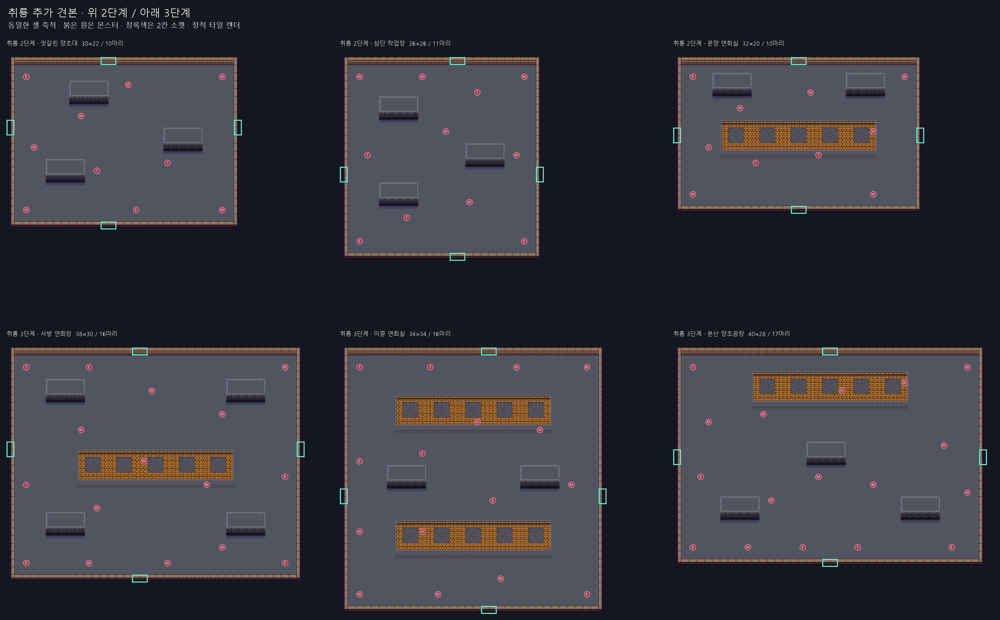
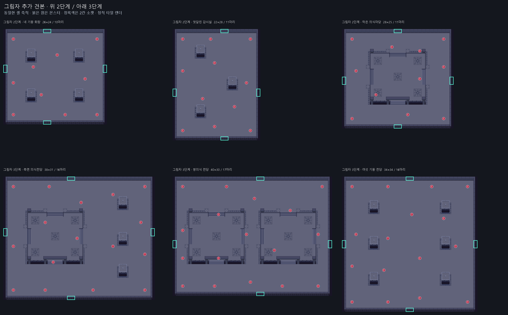
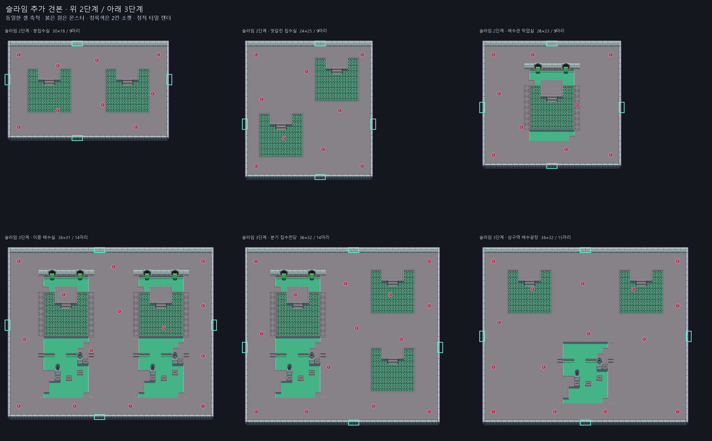

> 등록 상태 업데이트 (2026-09-14): 사용자 요청으로 일반 방 24개(테마별 2단계 4개·3단계 4개)를 테마 라이브러리에 등록했다. 아래 제작 당시의 미등록/승인 대기 설명은 과거 상태다. 현재 difficultyTier 필터가 없어 1단계에서도 선택될 수 있다. Unity 플레이 검증은 미실행이다.

# 추가 일반 전투방 견본 18개

기존 스타일을 유지하며 각 테마의 2·3단계에 3개씩 추가했다. 첫 견본과 합쳐 총 24개다. 새 에셋 이름의 `_02`, `_03`, `_04`는 변형 번호이며 난이도 단계는 `Stage2`/`Stage3`으로 구분한다.

원래 타일 비율의 단상·기둥·의식 구역·배수 조각을 서로 다른 위치에 조합했다. 몬스터를 여러 구역에 분산하고 외곽 우회 공간을 확보했다. 자세한 열기 방법과 메타데이터 설명은 [기존 견본 설명](README.md)을 따른다.

## 취룡

| 단계 / 변형 | 구성 | 크기 | 이동 셀 | 몬스터 | 에셋 | 이미지 |
| --- | --- | --- | --- | --- | --- | --- |
| 2단계 / 02 | 엇갈린 양조대 | 30×22 | 515 | 10 | [Dragon_Combat_Stage2_Sample_02](../../../Assets/_Project/Data/Dungeon/Rooms/BossThemes/Dragon/Dragon_Combat_Stage2_Sample_02.asset) | [보기](Dragon_Combat_Stage2_Sample_02.png) |
| 2단계 / 03 | 삼단 작업장 | 26×26 | 531 | 11 | [Dragon_Combat_Stage2_Sample_03](../../../Assets/_Project/Data/Dungeon/Rooms/BossThemes/Dragon/Dragon_Combat_Stage2_Sample_03.asset) | [보기](Dragon_Combat_Stage2_Sample_03.png) |
| 2단계 / 04 | 문양 연회실 | 32×20 | 510 | 10 | [Dragon_Combat_Stage2_Sample_04](../../../Assets/_Project/Data/Dungeon/Rooms/BossThemes/Dragon/Dragon_Combat_Stage2_Sample_04.asset) | [보기](Dragon_Combat_Stage2_Sample_04.png) |
| 3단계 / 02 | 사방 연회장 | 38×30 | 948 | 16 | [Dragon_Combat_Stage3_Sample_02](../../../Assets/_Project/Data/Dungeon/Rooms/BossThemes/Dragon/Dragon_Combat_Stage3_Sample_02.asset) | [보기](Dragon_Combat_Stage3_Sample_02.png) |
| 3단계 / 03 | 이중 연회실 | 34×34 | 994 | 16 | [Dragon_Combat_Stage3_Sample_03](../../../Assets/_Project/Data/Dungeon/Rooms/BossThemes/Dragon/Dragon_Combat_Stage3_Sample_03.asset) | [보기](Dragon_Combat_Stage3_Sample_03.png) |
| 3단계 / 04 | 분산 양조광장 | 40×28 | 943 | 17 | [Dragon_Combat_Stage3_Sample_04](../../../Assets/_Project/Data/Dungeon/Rooms/BossThemes/Dragon/Dragon_Combat_Stage3_Sample_04.asset) | [보기](Dragon_Combat_Stage3_Sample_04.png) |

## 그림자

| 단계 / 변형 | 구성 | 크기 | 이동 셀 | 몬스터 | 에셋 | 이미지 |
| --- | --- | --- | --- | --- | --- | --- |
| 2단계 / 02 | 네 기둥 회랑 | 26×24 | 504 | 10 | [Shadow_Combat_Stage2_Sample_02](../../../Assets/_Project/Data/Dungeon/Rooms/BossThemes/Shadow/Shadow_Combat_Stage2_Sample_02.asset) | [보기](Shadow_Combat_Stage2_Sample_02.png) |
| 2단계 / 03 | 엇갈린 감시실 | 22×28 | 502 | 11 | [Shadow_Combat_Stage2_Sample_03](../../../Assets/_Project/Data/Dungeon/Rooms/BossThemes/Shadow/Shadow_Combat_Stage2_Sample_03.asset) | [보기](Shadow_Combat_Stage2_Sample_03.png) |
| 2단계 / 04 | 작은 의식마당 | 28×25 | 588 | 11 | [Shadow_Combat_Stage2_Sample_04](../../../Assets/_Project/Data/Dungeon/Rooms/BossThemes/Shadow/Shadow_Combat_Stage2_Sample_04.asset) | [보기](Shadow_Combat_Stage2_Sample_04.png) |
| 3단계 / 02 | 측면 의식전당 | 38×31 | 1016 | 16 | [Shadow_Combat_Stage3_Sample_02](../../../Assets/_Project/Data/Dungeon/Rooms/BossThemes/Shadow/Shadow_Combat_Stage3_Sample_02.asset) | [보기](Shadow_Combat_Stage3_Sample_02.png) |
| 3단계 / 03 | 쌍의식 전당 | 40×30 | 1044 | 17 | [Shadow_Combat_Stage3_Sample_03](../../../Assets/_Project/Data/Dungeon/Rooms/BossThemes/Shadow/Shadow_Combat_Stage3_Sample_03.asset) | [보기](Shadow_Combat_Stage3_Sample_03.png) |
| 3단계 / 04 | 여섯 기둥 전당 | 34×34 | 988 | 16 | [Shadow_Combat_Stage3_Sample_04](../../../Assets/_Project/Data/Dungeon/Rooms/BossThemes/Shadow/Shadow_Combat_Stage3_Sample_04.asset) | [보기](Shadow_Combat_Stage3_Sample_04.png) |

## 슬라임

| 단계 / 변형 | 구성 | 크기 | 이동 셀 | 몬스터 | 에셋 | 이미지 |
| --- | --- | --- | --- | --- | --- | --- |
| 2단계 / 02 | 쌍집수실 | 30×18 | 448 | 9 | [Slime_Combat_Stage2_Sample_02](../../../Assets/_Project/Data/Dungeon/Rooms/BossThemes/Slime/Slime_Combat_Stage2_Sample_02.asset) | [보기](Slime_Combat_Stage2_Sample_02.png) |
| 2단계 / 03 | 엇갈린 집수실 | 24×25 | 506 | 9 | [Slime_Combat_Stage2_Sample_03](../../../Assets/_Project/Data/Dungeon/Rooms/BossThemes/Slime/Slime_Combat_Stage2_Sample_03.asset) | [보기](Slime_Combat_Stage2_Sample_03.png) |
| 2단계 / 04 | 배수관 작업실 | 26×23 | 460 | 9 | [Slime_Combat_Stage2_Sample_04](../../../Assets/_Project/Data/Dungeon/Rooms/BossThemes/Slime/Slime_Combat_Stage2_Sample_04.asset) | [보기](Slime_Combat_Stage2_Sample_04.png) |
| 3단계 / 02 | 이중 배수실 | 38×31 | 834 | 14 | [Slime_Combat_Stage3_Sample_02](../../../Assets/_Project/Data/Dungeon/Rooms/BossThemes/Slime/Slime_Combat_Stage3_Sample_02.asset) | [보기](Slime_Combat_Stage3_Sample_02.png) |
| 3단계 / 03 | 분기 집수전당 | 36×32 | 915 | 14 | [Slime_Combat_Stage3_Sample_03](../../../Assets/_Project/Data/Dungeon/Rooms/BossThemes/Slime/Slime_Combat_Stage3_Sample_03.asset) | [보기](Slime_Combat_Stage3_Sample_03.png) |
| 3단계 / 04 | 삼구역 배수광장 | 38×32 | 1004 | 15 | [Slime_Combat_Stage3_Sample_04](../../../Assets/_Project/Data/Dungeon/Rooms/BossThemes/Slime/Slime_Combat_Stage3_Sample_04.asset) | [보기](Slime_Combat_Stage3_Sample_04.png) |

## 제작 범위와 검증

- 기존 6개 에셋은 보존했다. 새 에셋 18개와 새 GUID를 가진 `.meta`만 추가했다. 기존 씬·프리팹·라이브러리·생성 프로필·런타임 코드는 이번 작업에서 수정하지 않았다.
- 모든 방은 Combat / Normal / 보상 잠금 없음 / 기본 웨이브 하나다. 이전과 마찬가지로 라이브러리 미등록이며 `difficultyTier`는 목표 단계 표시다. 자동 단계별 출현을 구현한 것이 아니다.
- 각 방은 네 방향의 2칸 소켓을 가진다. `_02`는 중앙에서 가로 -2/세로 +2칸, `_03`은 가로 +2/세로 -2칸 이동한 출입구를 사용하고 `_04`는 중앙 출입구다. 마주 보는 소켓은 같은 축에 둔다.
- 기준 셀 검증: 닫힌 외곽 벽, 소켓의 Floor+Wall과 경계 방향, 전체 이동 셀 및 출입구 연결성, 몬스터 주변 3×3 이동 가능 셀과 입구 맨해튼 거리 5칸 이상.
- 데이터 검증: YAML 저장 후 재파싱 일치, 타일/오브젝트 GUID와 프리팹/StageMonsterSet fileID, 레이어별 중복/범위, 장식의 기반 레이어, 고유 room/placement/socket ID. 기존 6개 에셋의 해시 보존과 라이브러리 미등록 확인.
- 18개 정적 타일 렌더를 테마별 비교 시트에서 확인했다. 이미지는 스프라이트 타일과 배치 마커이며 실제 Unity 플레이 화면이 아니다.
- **Unity import/compile, Room Piece Editor 검증, 맵 조립 및 Play Mode는 미실행.** 실제 Collider·스프라이트 크기·출입구 접합·전투 밀도·슬라임 분열 성능은 후속 확인이 필요하다.
- 몬스터 수는 견본 초깃값이며, 면적 증가가 반드시 체감 난이도 증가로 이어지지는 않는다. 정식 등록 전 단계별 후보 정책과 플레이 밸런스를 확인한다.

Doc Impact Check: **SessionLog + reference-only 견본 설명**. ErrorLog/DecisionLog/StructureMemory 변경 없음. Presentation HTML stale candidate 없음.
