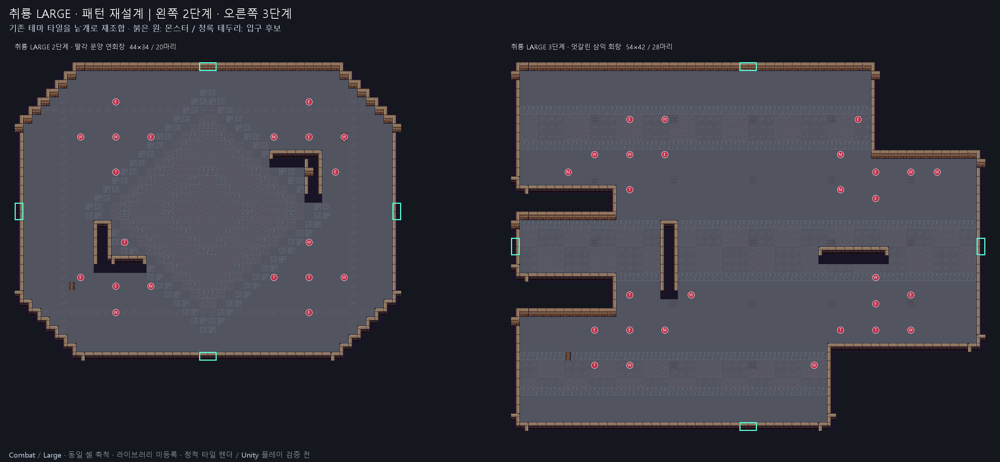
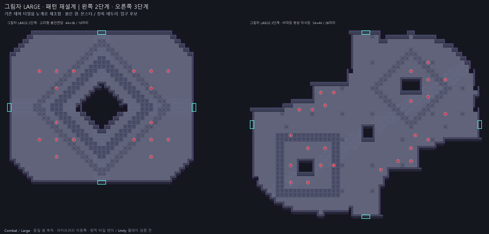
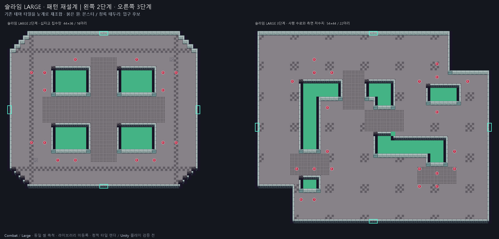

# 2·3단계 Large 방 승인용 견본 — 패턴 재설계

테마별 2개, 총 6개. 기존 견본을 사용자의 다양화 요청에 맞춰 수정했다. 기존 방의 장식 묶음 복제 대신, 테마 타일을 낱개로 조합해 윤곽·바닥 무늬·벽·수로를 새로 구성했다. 2026-09-14 사용자 승인으로 각 테마 라이브러리에 2개씩 등록했다. 기존 Normal 견본과 별도이다.

| 테마 | 단계 | 견본 | 예약 크기(셀) | 이동 가능 셀 | 초기 몬스터 |
|---|---:|---|---|---:|---:|
| 취룡 | 2 | [팔각 문양 연회장](../../../../Assets/_Project/Data/Dungeon/Rooms/BossThemes/Dragon/Dragon_Combat_Large_Stage2_Sample.asset) | 44×34 | 1220 | 20 |
| 취룡 | 3 | [엇갈린 삼익 회랑](../../../../Assets/_Project/Data/Dungeon/Rooms/BossThemes/Dragon/Dragon_Combat_Large_Stage3_Sample.asset) | 54×42 | 1674 | 28 |
| 그림자 | 2 | [고리형 봉인전당](../../../../Assets/_Project/Data/Dungeon/Rooms/BossThemes/Shadow/Shadow_Combat_Large_Stage2_Sample.asset) | 44×36 | 1284 | 18 |
| 그림자 | 3 | [비대칭 쌍성 의식장](../../../../Assets/_Project/Data/Dungeon/Rooms/BossThemes/Shadow/Shadow_Combat_Large_Stage3_Sample.asset) | 54×44 | 1329 | 26 |
| 슬라임 | 2 | [십자교 집수장](../../../../Assets/_Project/Data/Dungeon/Rooms/BossThemes/Slime/Slime_Combat_Large_Stage2_Sample.asset) | 44×36 | 1136 | 16 |
| 슬라임 | 3 | [사행 수로와 측면 저수지](../../../../Assets/_Project/Data/Dungeon/Rooms/BossThemes/Slime/Slime_Combat_Large_Stage3_Sample.asset) | 54×44 | 1724 | 22 |

## 새 구성

- 취룡 2: 팔각 윤곽, 중앙 마름모 문양, 서로 반대쪽을 향하는 ㄴ자 벽.
- 취룡 3: 엇갈린 세 날개 회랑, 띠 모양 포장과 가로·세로 차폐벽.
- 그림자 2: 중앙 봉인 공간을 감싸는 고리 동선과 두 겹의 마름모 문양.
- 그림자 3: 비대칭 쌍엽 윤곽, 사각·마름모 의식 문양을 대각선 포장으로 연결.
- 슬라임 2: 직접 구성한 네 집수조와 십자 격자 다리, 외곽 순환 동선.
- 슬라임 3: 굽은 수로를 가로지르는 여러 다리와 별도 측면 저수지. 수로는 이동 불가 영역이며 새 피해 효과는 없다.

## 범위와 이미지 해석

- 기존 여섯 에셋의 GUID, roomId, 예약 크기, 소켓, 몬스터 수, 난이도 메타데이터를 유지했다.
- `roomType = Combat`, `sizeTag = Large (2)`, `difficultyTier = 2 / 3`, `selectionWeight = 0.5`. 단일 웨이브, 상자 없음.
- 새 타일 텍스처·런타임 코드는 추가하지 않았다. 기존 테마별 타일을 셀 단위로 다시 배치했다.
- 비교 이미지 왼쪽 2단계 / 오른쪽 3단계, 동일한 셀 축척. 붉은 원은 몬스터, 청록 테두리는 2셀 입구 후보다.
- 기존 스프라이트를 정적으로 렌더한 이미지다. 실제 Unity 게임 화면과 조명·타일 충돌체 표현은 다를 수 있다.
- 현 런타임은 Large를 현재 진행 단계와 동일한 difficultyTier에서 정확히 1개 선택한다. 일반 방의 단계별 개수 비율에는 Large를 포함하지 않는다. 2·3단계 Large가 1단계에 나오는 경로를 제한했다.
- 비교 이미지는 승인 당시 렌더이므로 하단의 미등록 표기는 과거 상태다. 현재 등록 상태는 이 문서를 기준으로 한다.

## 검증과 남은 위험

- YAML 저장·재로드 일치, 레이어 좌표 중복/범위, 타일·몬스터 참조 GUID/fileID, 몬스터 주변 3×3 셀 검사 통과.
- 소켓 Floor+Wall, 소켓 개방 시 전체 이동 가능 셀 연결, 바닥 외곽 4방향 벽 폐쇄 검사 통과. 직사각형 전체 둘레 대신 실제 비정형 바닥 윤곽을 검사한다.
- 장식 레이어의 바닥/벽 지원 관계 검사 통과. 몬스터 배치는 새 지형에서 다시 계산했다.
- 등록 시 기존 방·메타 해시 유지, 라이브러리별 기존 목록 순서와 다른 필드 유지, 신규 2개 참조 추가 및 중복 없음 검사 통과.
- Unity import/컴파일/플레이 검증 미실행. 새 모서리의 벽 스프라이트 이음새·실제 충돌체, 다리에서 대시 및 몬스터 추적을 확인해야 한다.
- 예약 크기와 몬스터 수가 같아도 벽·수로로 실사용 면적이 줄었다. 그림자 3단계 등의 밀도와 분열/원거리 전투 밸런스는 플레이 검증이 필요하다.

## 취룡

## 그림자

## 슬라임

