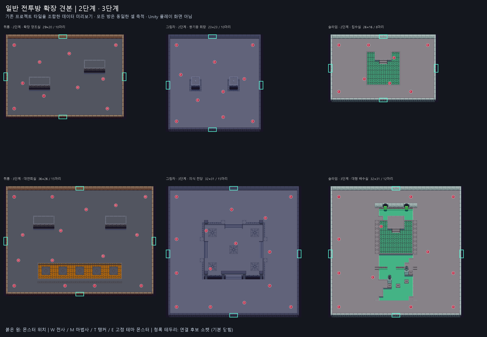

> 현재 상태 (2026-09-14): 일반 방 24개 등록 완료. 일반 전투방 개수 기준 1단계 100/0/0, 2단계 50/50/0, 3단계 20/40/40의 단계별 비율을 적용한다. 소수 개수는 최대 나머지와 시드 동률 처리로 배분하며 Large는 별도로 현재 단계 1개다. 실제 전투 밸런스 플레이 검증은 남아 있다.

# 테마별 2·3단계 일반 전투방 견본

목적은 몬스터 배치를 늘릴 수 있는 공간 확보와 단계별 난이도 설계 검토다. 현재 결과는 **첫 견본 6개 + 추가 견본 18개, 총 RoomTemplateSO 24개**이며, 확정된 밸런스나 진행 단계별 출현 정책이 아니다.

[추가 견본 18개와 테마별 비교 이미지](AdditionalSamples.md)

아래는 첫 견본 6개다.

## 크기와 배치

크기는 예약 영역(셀), 이동 셀은 `Floor - Wall`의 정적 집계다. 스프라이트 Collider 형상이나 실제 캐릭터 크기를 측정한 값은 아니다. 몬스터는 한 개의 기본 웨이브에 배치했다.

| 견본 | 예약 크기 | 이동 셀 | 몬스터 수 | Unity 에셋 | 미리보기 |
| --- | --- | --- | --- | --- | --- |
| 취룡 2단계 | 29×20 | 456 | 10 | [Dragon_Combat_Stage2_Sample](../../../Assets/_Project/Data/Dungeon/Rooms/BossThemes/Dragon/Dragon_Combat_Stage2_Sample.asset) | [이미지](Dragon_Combat_Stage2_Sample.png) |
| 취룡 3단계 | 36×26 | 786 | 15 | [Dragon_Combat_Stage3_Sample](../../../Assets/_Project/Data/Dungeon/Rooms/BossThemes/Dragon/Dragon_Combat_Stage3_Sample.asset) | [이미지](Dragon_Combat_Stage3_Sample.png) |
| 그림자 2단계 | 23×23 | 429 | 10 | [Shadow_Combat_Stage2_Sample](../../../Assets/_Project/Data/Dungeon/Rooms/BossThemes/Shadow/Shadow_Combat_Stage2_Sample.asset) | [이미지](Shadow_Combat_Stage2_Sample.png) |
| 그림자 3단계 | 32×31 | 860 | 15 | [Shadow_Combat_Stage3_Sample](../../../Assets/_Project/Data/Dungeon/Rooms/BossThemes/Shadow/Shadow_Combat_Stage3_Sample.asset) | [이미지](Shadow_Combat_Stage3_Sample.png) |
| 슬라임 2단계 | 26×16 | 336 | 8 | [Slime_Combat_Stage2_Sample](../../../Assets/_Project/Data/Dungeon/Rooms/BossThemes/Slime/Slime_Combat_Stage2_Sample.asset) | [이미지](Slime_Combat_Stage2_Sample.png) |
| 슬라임 3단계 | 32×31 | 765 | 12 | [Slime_Combat_Stage3_Sample](../../../Assets/_Project/Data/Dungeon/Rooms/BossThemes/Slime/Slime_Combat_Stage3_Sample.asset) | [이미지](Slime_Combat_Stage3_Sample.png) |

## 구성 의도와 참고 원본

- **취룡 2단계 / 확장 양조실**: 대각선으로 떨어진 단상 둘 사이에 넓은 교전 공간과 외곽 우회 동선을 둔다. `Dragon_Combat_Up2`의 외벽과 `Dragon_Combat_Wide`의 단상·몬스터 구성을 참고했다.
- **취룡 3단계 / 대연회실**: 단상 둘과 주황색 문양 바닥을 분리해 전투 구역을 넓힌다. `Dragon_Combat_1`의 주황색 바닥 조각과 적 구성을 사용했다. 문양과 단상은 원래 타일 비율을 유지한다.
- **그림자 2단계 / 쌍기둥 회랑**: `Shadow_Combat_3`의 외벽과 `Shadow_Combat_Wide`의 기둥을 조합했다. 기둥 사이 중앙 통로와 바깥쪽 우회로를 확보했다.
- **그림자 3단계 / 의식 전당**: `Shadow_Combat_Large_Nieun`의 의식 문양·계단 구역을 중앙에 배치하고, 외곽 공간을 넓혔다. 원본의 보상 상자는 포함하지 않는다.
- **슬라임 2단계 / 집수실**: `Slime_Combat_Wide`의 청록 외벽과 `Slime_Combat_Large_Nieun`의 녹색 타일 구역을 조합했다. 원거리 교전과 분열 몬스터 회피 공간을 우선했다.
- **슬라임 3단계 / 대형 배수실**: 기존 배수관·물길·징검 구조를 원래 비율로 배치하고 양쪽에 넓은 우회 공간을 둔다. 물길의 실제 통과·충돌은 원본 타일 설정을 따른다. 새 피해 또는 낙사 동작은 추가하지 않았다.

## Unity에서 열기

1. 필요한 경우 `Assets > Refresh`로 새 에셋을 가져온다.
2. `Tools > Dungeon > Room Piece Editor`를 연다.
3. 해당 테마 라이브러리를 선택한다.
4. `기존 방 직접 선택`에 위 표의 새 에셋을 넣고 `원본 편집`으로 연다.
5. 타일·오브젝트 및 출입구를 확인하고 검증한다. 맵 미리보기에서는 현재 방을 포함해 확인한다.

새 방 24개는 테마 라이브러리의 `rooms`에 등록됐다. 현재 단계별 개수 비율에 따라 일반 전투방 후보로 사용한다. 단계별 구성의 구조는 [Dungeon Template Selection](../../StructureMemory/DungeonTemplateSelection.md)을 참고한다.

## 메타데이터와 범위

- `roomType = Combat`, `combatMetadata.sizeTag = Normal`, `killLockRewardTag = None`이다. 이번의 2·3단계 큰 일반 방과 기존 생성기의 특별 `Large` 분류/수량 제한을 분리하기 위해 Normal을 명시했다.
- `difficultyTier = 2 / 3`은 방의 콘텐츠 단계다. 기존 0은 1단계로 해석한다. 진행도는 처치한 보스 수 + 1로 생성 시 확정하며, 콘텐츠 단계와 0 기반 진행도 필드를 혼용하지 않는다.
- `selectionWeight = 1`이므로 추후 라이브러리에 등록하면 현 정책에서는 단계 구분 없이 후보가 될 수 있다.
- 첫 견본 6개는 중앙에 네 방향의 폭 2 소켓을 갖고, 두 소켓 셀 모두 Floor와 Wall이 있다. 실제 생성기는 연결에 사용된 소켓만 연다.
- 기존 몬스터 프리팹/StageMonsterSet 참조를 재사용한다. 공통 역할의 실제 몬스터는 기존 진행도 정책을 따르고, 고정 테마 몬스터는 해당 프리팹을 따른다.
- 새 런타임 코드, 프리팹, 씬, SO 스키마, 기존 에셋/GUID 및 생성 프로필을 변경하지 않았다.

## 검증과 남은 확인

- 새 YAML 재파싱, 고유 room/placement/socket ID, 여덟 레이어의 중복 셀·범위·GUID, FloorDetail/GroundDecoration/WallDetail의 기반 레이어를 확인했다.
- 외곽 벽, 폭 2 소켓의 경계 방향과 Floor+Wall, 소켓을 열었을 때의 4방향 셀 연결성을 확인했다.
- 모든 몬스터는 도달 가능한 Floor 위에 있고 Wall과 겹치지 않는다. 각 기준 셀 주변 3×3칸이 이동 가능하며 소켓과 맨해튼 거리 5칸 이상을 확보했다. 프리팹의 실제 크기 검사는 별도다.
- 이미지는 새 에셋의 타일 GUID와 원본 Sprite rect를 읽어 만든 정적 렌더다. 몬스터는 위치 마커로 표시한다. Unity의 RuleTile, 정렬, 조명, 애니메이션, 물리 Collider 렌더링을 대체하지 않는다.
- **Unity Editor import/compile, 제작 툴 검증, 맵 생성 및 Play Mode는 실행하지 않았다.** 실제 방/복도 접합, 이동·회피, 몬스터 동시 활성 성능, 방 입장/문 잠금/클리어를 확인해야 한다.
- 몬스터 수는 견본 초기값이다. 3단계는 총 적 수와 전투 구역이 늘지만, 면적 증가로 밀도가 낮아질 수도 있으므로 난이도 상승을 단정하지 않는다. 특히 슬라임 분열 수와 원거리 집중 사격은 플레이 테스트가 필요하다.

관련 제작 경로: [방 제작 가이드](../../Guides/ContentAuthoring/ProceduralDungeonRoomAuthoringGuide.md), [방 파이프라인 구조](../../StructureMemory/ProceduralDungeonRoomPipeline.md).

Doc Impact Check: **SessionLog + reference-only 견본 설명**. 런타임 구조/지속 정책은 변경하지 않았으므로 StructureMemory·ErrorLog·DecisionLog 업데이트는 없다. Presentation HTML stale candidate 없음.
