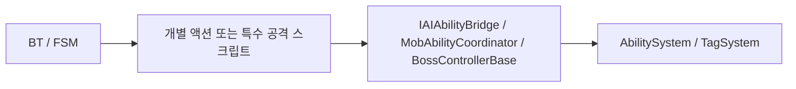
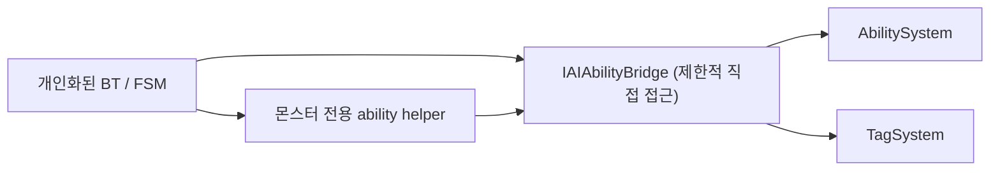

# Personalized BT + Ability Structure Proposal

> Legacy / Review  
> 이 문서는 개인화 BT 구조를 검토하기 위해 작성된 제안 문서입니다.  
> 현재 표준 문서가 아니라, 당시 논의와 설계 규칙을 추적하기 위한 이력 문서로 봅니다.

이 문서는 **몬스터별로 개인화된 BT(Behavior Tree)** 를 사용할 때,

- BT
- 몬스터 고유 ability helper
- 공통 AI-ASC bridge

를 어떤 관계로 두는 것이 좋은지 논의하기 위한 제안 문서입니다.

이 문서는 아직 “확정 표준”이 아니라, **의견 교류용 설계안**입니다.

---

## 왜 이 문서를 쓰는가

지금까지 정리한 결과, 프로젝트에는 이미 다음 기준이 있습니다.

- 공통 AI-ASC 최소 계약
  - `IAIAbilityBridge`
- 보스 쪽 bridge
  - `IBossAbilityStateBridge`
- 일반 몹 쪽 bridge/coordinator
  - `IMobAbilityBridge`
  - `MobAbilityCoordinator`

그리고 direct call도 어느 정도 정리됐습니다.

- BT의 [GAS_Actions.cs](../../Assets/Script/Enemy/Boss/Behavior/GAS_Actions.cs)
- 특수 공격의 [TackleAttack.cs](../../Assets/Script/Enemy/Mob/TackleAttack.cs)

하지만 여기서 다음 질문이 남습니다.

> BT를 더 범용적으로 유지할 것인가,  
> 아니면 몬스터별 전투 문법을 반영한 “개인화된 BT”로 설계할 것인가?

이 문서는 그중 **개인화된 BT** 방향이 어떤 구조를 요구하는지 정리합니다.

---

## 이 구조가 쓰이는 곳

이 구조는 다음 상황에서 특히 유용합니다.

### 1. 몬스터 고유 공격 문법이 강한 경우

예:

- 태클처럼
  - 사거리
  - 벽 여부
  - 경고 준비
  - 접촉 피해
  가 강하게 묶인 공격
- 안개 생성형 공격
- 사전 락온 후 발사하는 공격

이런 기술은 “그 ability 하나의 실행 가능성 판단”이 몬스터 고유 전투 문법과 깊게 연결됩니다.

즉 범용 BT 노드 하나로 모두 처리하기보다,
**그 몬스터의 BT가 자기 helper와 더 잘 소통하는 구조**가 자연스럽습니다.

---

### 2. 몬스터마다 우선순위 판단이 많이 다른 경우

예:

- A 몬스터는 “벽이 막히면 태클 대신 평타”
- B 몬스터는 “사거리 밖이면 이동 후 발사”
- C 몬스터는 “실드 중일 땐 특정 스킬 금지”

이런 차이는 범용 BT보다 **개인화된 BT**에서 훨씬 다루기 쉽습니다.

---

### 3. Ability 내부 사정을 BT가 조금은 이해해야 하는 경우

우리는 BT가 `AbilityDefinition` 내부 세부 구현까지 깊게 알게 되는 것은 피하고 싶습니다.

하지만 개인화된 BT라면,

- 이 몬스터의 태클 helper
- 이 몬스터의 락온 공격 helper
- 이 몬스터의 phase-aware attack helper

같은 **몬스터 전용 helper** 와는 꽤 가까이 붙어도 됩니다.

이 경우 BT가 아는 것은

- ASC 구현 세부
- GAS 내부 구조

가 아니라,

- **그 몬스터의 전투 문법**

에 더 가깝습니다.

---

## 제안하는 구조

핵심은 세 층입니다.

1. **공통 AI-ASC bridge**
2. **몬스터 전용 ability helper**
3. **개인화된 BT / FSM**

---

## 1. 공통 AI-ASC bridge

대표:

- [IMobAbilityBridge.cs](../../Assets/Script/Enemy/Mob/IMobAbilityBridge.cs)
- [IBossAbilityStateBridge.cs](../../Assets/Script/Enemy/Boss/FSM/Core/IBossAbilityStateBridge.cs)

공통 최소 계약:

- `IsAbilityExecutionBusy`
- `TryStartAbility(...)`
- `CancelActiveAbility(...)`
- `HasStateTag(...)`

이 계층의 역할:

- AI가 `AbilitySystem`, `TagSystem`을 직접 모르도록 막는다
- ASC 구현 변경이 AI 쪽으로 바로 새지 않게 한다
- busy / tag / start / cancel 같은 최소 소통만 제공한다

즉 이 계층은 **항상 얇게 유지**하는 것이 목표입니다.

---

## 2. 몬스터 전용 ability helper

예:

- [TackleAttack.cs](../../Assets/Script/Enemy/Mob/TackleAttack.cs)
- [ShadowServant.cs](../../Assets/Script/Enemy/Mob/ShadowServant/ShadowServant.cs)
- [StrangeCandlestick.cs](../../Assets/Script/Enemy/Mob/StrangeCandlestick/StrangeCandlestick.cs)

이 계층의 역할:

- 몬스터 고유 전투 문법을 캡슐화한다
- 실행 가능성 판단에 필요한 특수 규칙을 모은다
- 공격 문맥을 만든다

예:

- `CanTryTackle`
- `TryBuildTackleContext`
- `CanTryAttack`
- `TryBuildAttackContext`
- `CanTryProjectileAttack`
- `TryBuildProjectileAttackContext`

이 계층은 `AbilityDefinition` 자체보다 **몬스터 고유 전투 규칙**을 더 잘 압니다.

즉 “ASC와 소통하는 공통 계약”과 “몬스터 고유 문법” 사이의 **중간 문맥 계층**입니다.

**몬스터 AI의 개성이 가장 많이 드러나는 계층이 바로 여기입니다.**

- bridge는 어떤 몬스터든 동일한 계약을 씁니다
- BT의 골격(우선순위 결정 흐름)은 몬스터마다 크게 다르지 않습니다
- helper만이 그 몬스터만의 전투 조건과 문맥을 담습니다

따라서 새 몬스터를 만들 때 실질적인 설계 작업 대부분은 **helper를 설계하는 것**입니다.

---

## 3. 개인화된 BT / FSM

이 계층의 역할:

- 어떤 행동을 지금 시도할지 결정한다
- helper가 제공하는 몬스터 고유 문맥을 읽는다
- 최종적으로 bridge에 실행 요청을 보낸다

즉 개인화된 BT는:

- ASC 내부는 모름
- 몬스터 고유 helper는 앎
- bridge를 통해 실행만 요청

이 구조를 가집니다.

---

## 현재 구조와 목표 구조 비교

### 현재



현재는 이 구조가 꽤 좋아졌지만,
특수 공격 스크립트가 아직 조금 무겁고,
BT와 helper의 경계가 완전히 선명하진 않은 부분이 있습니다.

---

### 목표



핵심은:

- BT/FSM는 실행 “결정”을 담당
- helper는 몬스터 고유 전투 문법을 담당
- bridge는 ASC 소통만 담당

즉 **결정 / 문맥 / 실행**을 분리합니다.

---

## BT가 bridge에 직접 접근해도 되는 범위

이 문서에서 가장 중요한 기준은 이겁니다.

### BT -> bridge 직접 허용

BT/FSM가 bridge에 **직접** 접근해도 되는 것은 얕은 상태 질의와 제어만입니다.

- `IsAbilityExecutionBusy`
- `HasStateTag(...)`
- `CancelActiveAbility(...)`

이 값들은:

- 몬스터 고유 문맥을 거의 몰라도 되고
- ability helper를 우회해도 구조가 크게 흐트러지지 않습니다

즉 **현재 상태 확인 / 안전한 중단** 성격의 질의만 direct 허용입니다.

---

### BT -> helper -> bridge 경유가 필요한 것

다음은 반드시 helper를 거치는 쪽이 좋습니다.

- 실행 가능성 판단
  - `CanTryTackle`
  - `CanShoot`
  - `CanUseDashAttack`
- 실행 문맥 생성
  - `TryBuildTackleContext`
  - `TryCreateAttackContext`
- 최종 실행 요청
  - `TryStartAbility(...)`

왜냐면 이 세 가지는 모두

- 사거리
- 벽 여부
- 타겟 유효성
- 특수 공격 규칙
- 몬스터 고유 전투 문법

과 강하게 연결되기 때문입니다.

즉 BT가 “어차피 bridge가 있으니 바로 실행” 쪽으로 흐르지 않게 하려면,
**실행 가능성 판단과 실행 요청은 helper 경유가 기본 규칙**이어야 합니다.

한 줄 기준:

- **상태 질의는 BT -> bridge direct 허용**
- **실행 관련 판단과 요청은 BT -> helper -> bridge**

---

## BT 전형적인 흐름 예시

이 규칙을 적용한 BT의 전형적인 실행 순서는 다음과 같습니다.

```text
bridge.IsAbilityExecutionBusy()  →  바쁘면 전부 스킵
bridge.HasStateTag(Stunned)      →  기절 중이면 전부 스킵

helper.CanTryTackle()            →  태클 가능하면
  helper.TryBuildTackleContext() →  문맥 만들고
    bridge.TryStartAbility(...)  →  실행 요청
```

즉 BT는:

- bridge로 **관문 체크**를 먼저 하고
- helper로 **개별 ability 판단**을 하고
- bridge로 **최종 실행 요청**을 보냅니다

---

## 이 구조에서 BT가 알면 되는 것

개인화된 BT라도, BT가 너무 많은 걸 알면 안 됩니다.

BT가 알아도 되는 것:

- 지금 시도 가능한가
- 타겟이 유효한가
- 특별한 문맥이 준비됐는가
- 다른 행동으로 fallback해야 하는가

BT가 몰라야 하는 것:

- `AbilitySystem` 내부 구현 세부
- `AbilityDefinition` 내부 사유/실패 사유 전체
- gameplay effect / spec / token 같은 ASC 디테일

즉 개인화된 BT는 “범용 엔진”이 아니라,
**그 몬스터 전투 문법의 상위 오케스트레이터**여야 합니다.

---

## 왜 이 구조가 좋은가

### 1. BT가 ASC 구현에 덜 묶인다

공통 bridge가 ASC 접점을 계속 막아줍니다.

### 2. 특수 공격이 지나치게 거대해지는 걸 막는다

특수 공격 스크립트는

- 전투 문맥
- 실행 가능성
- 경고 표시

를 관리하되,
실행 책임은 bridge 쪽으로 넘길 수 있습니다.

### 3. 몬스터별 개성이 잘 살아난다

범용 BT만으로 억지 일반화하지 않아도 됩니다.

### 4. 재사용 포인트가 분명해진다

- 공통 bridge는 재사용
- helper는 몬스터별
- BT도 몬스터별

즉 재사용 범위가 무리 없이 나뉩니다.

---

## helper가 다뤄야 하는 것

이 문서 기준으로 helper는 아래를 책임집니다.

- ability 고유 실행 가능성 판단
- ability 고유 문맥 준비
- 필요 시 bridge 호출용 파라미터 패키지 생성

중요한 점은 **쿨다운도 helper가 같이 다루는 쪽이 더 안전하다**는 것입니다.

예를 들어 태클의 경우:

- 쿨다운
- 사거리
- 벽 여부
- 타겟 유효성

이 모두 `CanTryTackle` 안에 같이 들어가는 편이 좋습니다.

그 이유는:

- BT가 “쿨다운은 bridge에서 직접 보고, 나머지는 helper에서 본다” 식으로 갈라 보기 시작하면
- helper를 우회하는 direct 실행 유혹이 생기기 때문입니다.

즉 BT는 가능하면

- `CanTryX`
- `TryBuildContext`

같은 **얕은 helper 질의**만 보고,
쿨다운 같은 세부 조건도 helper가 안에서 흡수하는 편이 구조를 덜 흔듭니다.

---

## helper 인터페이스 계약 방향

helper 인터페이스는 너무 풍부하면 안 됩니다.

권장 방향:

- `CanTryX(...)`
- `TryBuildContext(...)`

처럼 유지

주의할 점:

- BT가 context 내부 값을 여기저기 뜯어보기 시작하면
- helper 내부 문맥이 BT로 새기 시작합니다

그래서 가장 안전한 방향은:

- BT가 받는 것은
  - bool 하나
  - 또는 bridge 실행에 필요한 파라미터 패키지 하나

정도로 제한하는 것입니다.

즉 **context는 BT가 해석하는 데이터 구조가 아니라, helper가 준비한 실행 문맥**에 가깝게 유지하는 편이 좋습니다.

---

## 현재 기준으로 적용 가능한 예

### ShadowServant

- BT/FSM가 “지금 안개 공격을 쓸까?” 결정
- [ShadowServant.cs](../../Assets/Script/Enemy/Mob/ShadowServant/ShadowServant.cs)가 공격 문맥 제공
  - `CanTryAttack(...)`
  - `TryBuildAttackContext(...)`
  - `TryRequestAttack(...)`
- [MobAbilityCoordinator.cs](../../Assets/Script/Enemy/Mob/MobAbilityCoordinator.cs)가 ASC 실행 연결

### StrangeCandlestick

- BT/FSM가 “지금 락온 발사를 할까?” 결정
- [StrangeCandlestick.cs](../../Assets/Script/Enemy/Mob/StrangeCandlestick/StrangeCandlestick.cs)가 발사 조건/문맥 제공
  - `CanTryProjectileAttack(...)`
  - `TryBuildProjectileAttackContext(...)`
  - `TryRequestProjectileAttack(...)`
- coordinator가 실행 연결

### Tackle

- BT/FSM가 “지금 태클을 시도할까?” 결정
- [TackleAttack.cs](../../Assets/Script/Enemy/Mob/TackleAttack.cs)가 태클 문맥과 실행 가능성 제공
  - 쿨다운, 사거리, 벽 여부, 타겟 유효성 모두 `CanTryTackle` 안에서 처리
- coordinator가 ASC 실행 연결

즉 `tackle`은 이 구조에서 **좋은 시험 사례**가 됩니다.

---

## 이 구조를 쓸 때 조심할 점

### 1. BT가 helper의 실패 이유를 너무 깊게 알지 않게 한다

개인화된 BT라고 해도, helper가 돌려주는 정보를 너무 풍부하게 일반화하면
다시 BT가 ability 내부를 많이 알게 됩니다.

그래서 처음엔:

- `CanTryX`
- `TryBuildContext`

정도의 얕은 질의가 더 안전합니다.

---

### 2. helper가 실행 판단까지 다 가져가면 안 된다

helper는:

- 가능한가
- 어떤 문맥인가

를 말해주고,

실제로

- 지금 실행할까
- 다른 행동으로 fallback할까

는 BT/FSM가 판단하는 쪽이 좋습니다.

---

### 3. bridge를 너무 뚱뚱하게 만들지 않는다

`MobAbilityCoordinator`가 모든 특수 공격 도메인을 다 알게 되면 안 됩니다.

bridge/coordinator는:

- 실행 요청
- 취소
- busy
- tag
- helper 수준의 공통 ASC utility

정도까지만 맡는 쪽이 좋습니다.

---

## 현재 제안의 한 줄 요약

개인화된 BT를 쓴다면,

- **BT/FSM는 실행 결정을 맡고**
- **몬스터 전용 helper는 전투 문맥을 만들고**
- **공통 bridge는 ASC 소통만 맡는 구조**

가 가장 건강합니다.

즉 이 구조는

- 범용 BT 엔진을 만드는 문서가 아니라
- **몬스터별 전투 문법을 유지하면서도 ASC 결합은 억제하는 구조**

를 설명하는 문서입니다.

---

## 현재 기준으로 이미 결정된 것

이 문서 기준으로 이미 방향이 잡힌 항목은 다음과 같습니다.

1. helper query는 깊게 일반화하지 않는다
   - `CanTryX`
   - `TryBuildContext`
   정도의 얕은 질의가 기본이다
2. bridge는 얇게 유지한다
   - ASC 실행/취소
   - busy
   - tag 질의
   - 제한된 helper 수준 utility
   정도까지만 맡는다
3. BT가 bridge에 직접 접근해도 되는 범위는 제한한다
   - 상태 질의 / 취소만 direct 허용
   - 실행 판단과 실행 요청은 helper 경유

---

## 코드로 이미 옮겨진 것

현재 실제 코드에 반영된 항목은 다음과 같습니다.

### 1. 공통 AI-ASC 최소 계약

- [IMobAbilityBridge.cs](../../Assets/Script/Enemy/Mob/IMobAbilityBridge.cs)
  - `IAIAbilityBridge`
- [IBossAbilityStateBridge.cs](../../Assets/Script/Enemy/Boss/FSM/Core/IBossAbilityStateBridge.cs)

즉 다음 네 가지는 이미 코드 기준으로 공통 문맥입니다.

- `IsAbilityExecutionBusy`
- `TryStartAbility(...)`
- `CancelActiveAbility(...)`
- `HasStateTag(...)`

또한 helper 전용 ASC utility는 별도 계약으로 분리됐습니다.

- [IMobAbilityBridge.cs](../../Assets/Script/Enemy/Mob/IMobAbilityBridge.cs)
  - `IMobAbilityHelperAccess`

이 계약은:

- 쿨다운 조회/설정
- 상태 태그 add/remove
- 실행 컨텍스트 조회

를 helper 전용 문맥으로 고정하고, BT/FSM가 직접 알 필요 없는 ASC 보조 기능을 `IAIAbilityBridge` 바깥으로 밀어냅니다.

---

### 2. BT direct call 제거

- [GAS_Actions.cs](../../Assets/Script/Enemy/Boss/Behavior/GAS_Actions.cs)

현재 BT 노드는:

- `AbilitySystem.TryActivateAbility(...)` direct call 제거
- `TagSystem.HasTag(...)` direct call 제거
- `IAIAbilityBridge` resolve 후
  - 실행 요청
  - busy 확인
  - tag 질의
  를 사용합니다
- `AIAbilityBridgeActionBase` / `AIAbilityBridgeConditionBase`를 통해
  - BT 노드가 bridge 해석 경로를 공통 베이스로 공유합니다

즉 “BT는 ASC/TagSystem을 직접 만지지 않는다”는 원칙은 이미 1차 구현이 끝났습니다.

---

### 3. `TackleAttack`의 direct call 축소

- [TackleAttack.cs](../../Assets/Script/Enemy/Mob/TackleAttack.cs)
- [MobAbilityCoordinator.cs](../../Assets/Script/Enemy/Mob/MobAbilityCoordinator.cs)

현재는 다음 ASC 접점이 coordinator helper로 옮겨졌습니다.

- ability 실행 요청
- 쿨다운 조회/설정
- tag add/remove
- `AbilitySpec` 조회
- 이 중 쿨다운/태그/실행 컨텍스트 유틸리티는 `MobAbilityCoordinator` 공개 메서드가 아니라 `IMobAbilityHelperAccess`를 통해서만 접근하게 분리됐습니다.
- helper 공개 API도 1차로 정리됐습니다.
  - `CanTryTackle()`
  - `TryBuildTackleContext(...)`
  - `TryRequestTackle()`
- [StrangeCandlestick.cs](../../Assets/Script/Enemy/Mob/StrangeCandlestick/StrangeCandlestick.cs)도 같은 helper 공개 패턴을 따르기 시작했습니다.
  - `CanTryProjectileAttack(...)`
  - `TryBuildProjectileAttackContext(...)`
  - `TryRequestProjectileAttack(...)`
- [ShadowServant.cs](../../Assets/Script/Enemy/Mob/ShadowServant/ShadowServant.cs)도 같은 helper 공개 패턴을 따르기 시작했습니다.
  - `CanTryAttack(...)`
  - `TryBuildAttackContext(...)`
  - `TryRequestAttack(...)`
- 현재 helper 사례 3종(`TackleAttack`, `StrangeCandlestick`, `ShadowServant`)은 helper 전용 ASC utility를 `IMobAbilityHelperAccess` 문맥으로 사용하도록 맞춰졌습니다.

즉 `TackleAttack`는 아직 특수 공격 helper이지만, 예전처럼 ASC/TagSystem을 직접 두드리는 구조는 많이 줄었습니다.

---

## 아직 코드로 옮겨지지 않은 정책

아래 항목은 이 문서에서 중요하게 다루지만, 아직 “정책으로만 합의된 상태”입니다.

### 1. helper의 표준 인터페이스

문서에서는:

- `CanTryX`
- `TryBuildContext`

패턴을 권장합니다.

하지만 아직 없는 것:

- `IAbilityHelper<TContext>` 같은 공통 계약
- `CanTryAbility(...)` 같은 공통 시그니처

즉 지금은 helper 패턴을 **공용 규칙으로만** 합의했고, 공용 코드 모델로는 올리지 않았습니다.

다만 [TackleAttack.cs](../../Assets/Script/Enemy/Mob/TackleAttack.cs), [StrangeCandlestick.cs](../../Assets/Script/Enemy/Mob/StrangeCandlestick/StrangeCandlestick.cs), [ShadowServant.cs](../../Assets/Script/Enemy/Mob/ShadowServant/ShadowServant.cs)는 이 패턴의 **초기 구현 사례**로 볼 수 있습니다.

---

### 2. BT -> helper -> bridge 실행 순서의 강제

문서에서는:

- 상태 질의는 BT -> bridge direct 허용
- 실행 판단과 실행 요청은 BT -> helper -> bridge

를 표준으로 제안합니다.

하지만 아직 코드에는:

- 이 순서를 프레임워크 차원에서 강제하는 장치
- helper를 우회한 실행을 막는 공통 executor

가 없습니다.

즉 현재는 **정책상 확정 / 코드상 강제는 아직 아님**입니다.

---

### 3. 쿨다운은 helper가 흡수해야 한다는 규칙

문서에서는 쿨다운도 helper 쪽에서 같이 판단하는 것이 더 안전하다고 봅니다.

하지만 현재 코드는:

- `MobAbilityCoordinator`가 쿨다운 helper를 제공하고
- 이를 각 helper가 사용할 수 있는 상태

까지만 열려 있습니다.

아직 없는 것:

- BT가 쿨다운을 bridge에서 직접 읽지 않게 막는 코드 계약
- helper가 쿨다운까지 반드시 포함해서 판단하도록 하는 공통 인터페이스

즉 이것도 아직 정책 단계입니다.

---

### 4. helper context의 공통 형태

문서에서는:

- context를 BT가 깊게 뜯어보지 않는다
- bool 하나 또는 bridge 실행용 파라미터 패키지 하나가 안전하다

고 제안합니다.

하지만 아직 코드에는:

- 공통 context 타입
- 실행 파라미터 패키지의 표준 모델
- BT가 context 내부를 해석하지 못하게 하는 제한

이 없습니다.

즉 이 부분은 앞으로 실제 사례를 더 쌓아 보고 정할 영역입니다.

---

### 5. `TackleAttack`를 얼마나 더 쪼갤지

현재 `TackleAttack`는 direct call은 많이 줄었지만, 아직 아래 책임이 같이 있습니다.

- 실행 가능성 판단
- 문맥 생성
- 경고 표시
- 접촉 피해 타이밍

즉:

- `CanTryTackle`
- `TryBuildTackleContext`
- 실행 요청
- 접촉 처리

를 어디까지 나눌지는 아직 구현 정책이 아닙니다.

---

### 6. 개인화 BT의 공용 모델 보류

현재 문서의 결론은:

- 지금은 **공용 모델보다 공용 규칙이 더 중요하다**

입니다.

즉 아직 일부러 보류한 것:

- 개인화 BT 공통 base class
- 공통 node set
- 공통 helper registry

이것들은 지금 단계에서 억지로 공용화하지 않는 편이 더 안전하다고 보고 있습니다.

---

## 지금 단계의 안전한 해석

지금 상태를 가장 안전하게 정리하면 이렇습니다.

- **코드로 이미 굳은 것**
  - `IAIAbilityBridge`
  - BT direct call 제거
  - `IMobAbilityHelperAccess`
  - helper 사례 3종의 helper 전용 utility 접근 분리
    - `TackleAttack`
    - `StrangeCandlestick`
    - `ShadowServant`

- **정책으로만 굳은 것**
  - `CanTryX / TryBuildContext` 패턴
  - BT -> helper -> bridge 실행 순서
  - helper가 쿨다운까지 흡수해야 한다는 규칙
  - context를 BT가 깊게 해석하지 않는다는 규칙
  - 개인화 BT의 공용 모델 보류

즉 지금은 **공용 규칙을 먼저 고정하고, 실제 helper 사례를 더 쌓은 뒤 공용 모델을 판단하는 단계**로 보는 게 맞습니다.

---

## 현재 기준표

현재 개인화 BT 규칙을 더 짧게 보면 다음처럼 정리할 수 있습니다.

### 이미 코드로 강제된 것

1. BT는 `AbilitySystem`, `TagSystem`을 직접 만지지 않는다
   - [GAS_Actions.cs](../../Assets/Script/Enemy/Boss/Behavior/GAS_Actions.cs)
   - `AIAbilityBridgeActionBase`
   - `AIAbilityBridgeConditionBase`
2. BT/FSM의 얕은 ASC 문맥은 `IAIAbilityBridge`로 고정한다
   - busy
   - start
   - cancel
   - tag query
3. helper 전용 ASC utility는 `IMobAbilityHelperAccess`로 분리한다
   - 쿨다운 조회/설정
   - 상태 태그 add/remove
   - 실행 컨텍스트 조회
4. 초기 helper 사례 3종은 helper 전용 utility를 같은 방식으로 사용한다
   - [TackleAttack.cs](../../Assets/Script/Enemy/Mob/TackleAttack.cs)
   - [StrangeCandlestick.cs](../../Assets/Script/Enemy/Mob/StrangeCandlestick/StrangeCandlestick.cs)
   - [ShadowServant.cs](../../Assets/Script/Enemy/Mob/ShadowServant/ShadowServant.cs)

### 아직 정책으로만 남겨둔 것

1. helper 공개 API의 공통 인터페이스
   - `IAbilityHelper<TContext>`
   - `CanTryAbility(...)`
   같은 공통 모델은 아직 만들지 않음
2. BT -> helper -> bridge 실행 순서의 프레임워크 수준 강제
   - 지금은 규칙으로 합의
   - 공통 executor/action은 아직 보류
3. helper context를 BT가 해석하지 않게 만드는 공통 토큰 모델
   - 현재는 사례별 context
   - 공통 전달 패키지는 아직 없음
4. helper가 어디까지 비대해져도 되는지
   - `TackleAttack` 분해 수준
   - `MobAbilityCoordinator` helper 확장 한계
   는 아직 열린 쟁점

### 다음 강제 대상으로 보기 좋은 것

1. BT -> helper -> bridge 실행 순서의 구조적 강제
2. helper context를 BT가 직접 뜯지 않게 하는 전달 모델
3. helper 공개 API를 어디까지 공통 형태로 맞출지 판단

이 표의 목적은 단순합니다.

- 이미 코드로 굳은 규칙은 되돌리지 않고
- 아직 정책으로만 남은 항목만 다음 논의 대상으로 삼기 위함입니다.

---

## 다음에 의견을 모아야 할 쟁점

1. `TackleAttack`를 다음에 더 얇게 쪼갤지
2. `MobAbilityCoordinator` helper를 어디까지 키울지
3. 몬스터별 BT를 어디까지 개인화할지
4. helper context를 어떤 형태의 실행 파라미터 패키지로 고정할지

이 문서는 그 논의를 시작하기 위한 초안입니다.
